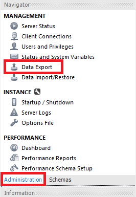
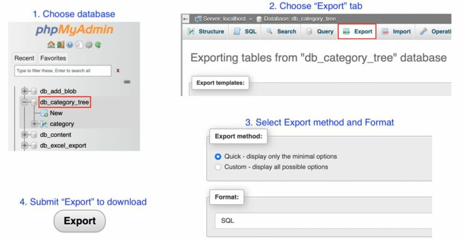

# BackUp
## Exportar
### 1. Exportar con mysqldump
#### - Exportar una o varias tablas de una base de datos
```mysqldump -u usuario -p 1234 base_datos tabla1 tabla2 > /ruta/backup.sql```

#### - Exportar una o varias bases de datos completas
```mysqldump -u usuario -p 1234 base_datos > /ruta/backup.sql```  
```mysqldump -u usuario -p 1234 --databases base_datos1 base_datos2 > /ruta/backup.sql```

#### - Exportar todas las bases de datos
```mysqldump -u usuario -p 1234 --all-databases > /ruta/backup.sql```
<br><br>

### 2. Exportar con Workbench

1. Ir a la pestaña "Data Export"
2. Seleccionar las bases de datos
3. Seleccionar las tablas
4. Seleccionar la opción de exportación  
  a. `Export to Dump Project Folder`: Cada TABLA se exporta en un fichero .sql  
  b. `Export to Self-Contained File`: Todas las BASES DE DATOS se exportan en un fichero .sql
5. Seleccionar la ruta de destino
6. Exportar
<br><br>

### 3. Exportar con phpMyAdmin

1. Seleccionar la base de datos
2. Ir a la pestaña "Exportar"
3. Seleccionar la opción de exportación  
  a. `Rápido`: Solo las tablas  
  b. `Personalizado`: Todas las opciones de exportación
4. Exportar
<br><br>

## Importar
### 1. Importar por línea de comandos
```bash
mysql -u usuario -p 1234 base_datos < /ruta/backup.sql #Importa una base de datos redirigiendo el fichero
mysql -u usuario -p 1234 < /ruta/backup.sql            #Importa todas las bases de datos redirigiendo el fichero
source /ruta/backup.sql                                #Importa todas las bases de datos con source
cat /ruta/backup.sql | mysql -u usuario -p 1234        #Importa todas las bases de datos con tuberías
copy/paste                                             #Copiar y pegar el contenido del fichero
```

### 2. Importar con Workbench o phpMyAdmin
Se puede apreciar en la imagen de ambas la pestalla `Data Import/Restore` o `Import` respectivamente.
<br><br><br>

## *[volver al índice](../../index.md)*