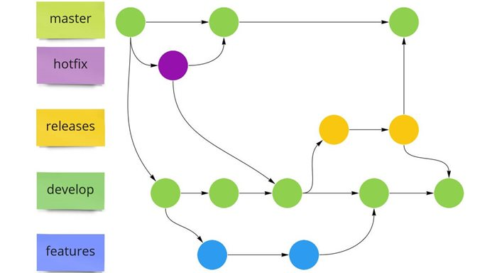

# Git Flow

## Estructura:
| Rama     | Descripción                                                                         |
|----------|-------------------------------------------------------------------------------------|
| Master   | Contiene el código que está en producción.                                          |
| Hotfix   | Contiene el código destinado a una corrección urgente sobre el código de producción |
| Release  | Contiene el código que se prepara antes de lanzar a producción.                     |
| Develop  | Contiene el código que está en desarrollo.                                          |
| Feature  | Contiene el código que está en desarrollo de una nueva funcionalidad.               |

   

## *[volver al índice](../index.md)*