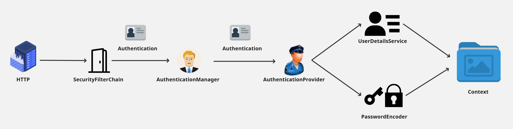

# Spring Security

## 1. Definición 🛡️
Spring Security es un potente y altamente personalizable framework de autenticación y control de acceso para aplicaciones Java. Forma parte del ecosistema más amplio de Spring Framework y proporciona servicios de seguridad integrales para aplicaciones Java, especialmente aquellas desarrolladas con Spring Framework.

---
<br>

## 2. Maven Dependency 📦
```xml
<dependency>
    <groupId>org.springframework.boot</groupId>
    <artifactId>spring-boot-starter-security</artifactId>
</dependency>
```
---
<br>

## 3. Flujo de Autenticación 🔐
1. Los filtros `SecurityFilterChain` miran la petición y, si trae credenciales, construyen un `Authentication` “sin autenticar”.
2. El manager `AuthenticationManager` se lo pasa a algún provider `AuthenticationProvider` capaz de validarlo.
3. Si es usuario/clave, ese provider usa el `UserDetailsService` + `PasswordEncoder`.
4. Si es JWT, el provider de JWT verifica firma y caducidad (no necesita UserDetailsService).
5. Si todo ok → `Authentication` queda autenticado y se guarda en el `SecurityContext`.
6. Luego se aplican las reglas de autorización (roles/permisos) que definiste.


---
<br>

## 4. Security Configuration ⚙️
En este archivo se definen: los filtros de seguridad, las políticas de sesión, las reglas de autorización y los métodos de autenticación.
- `@Configuration`: Indica que la clase puede ser utilizada por el contenedor IoC de Spring como fuente de definiciones de beans.
- `@EnableWebSecurity`: Habilita el soporte de seguridad web de Spring Security y proporciona integración con Spring MVC.
- `SecurityFilterChain`: Define una cadena de filtros de seguridad que se aplican a las solicitudes entrantes.
  - `HttpSecurity`: Permite configurar la seguridad basada en HTTP, como la autorización de solicitudes, la configuración de formularios de inicio de sesión, etc.
    - `authorizeHttpRequests()`: Configura la autorización de solicitudes HTTP.
      - `requestMatchers()`: Especifica las rutas que deben coincidir para aplicar las reglas de seguridad.
      - `permitAll()`: Permite el acceso a las rutas especificadas sin autenticación
      - `anyRequest()`: Coincide con cualquier solicitud no especificada previamente.
      - `authenticated()`: Requiere que todas las demás solicitudes estén autenticadas.
    - `sessionManagement()`: Configura la gestión de sesiones.
      - `SessionCreationPolicy.STATELESS`: Configura la política de creación de sesiones para que no se cree ni utilice ninguna sesión (útil para APIs REST).
      - `SessionCreationPolicy.IF_REQUIRED`: Configura la política de creación de sesiones para que se cree una sesión si es necesario (útil para aplicaciones web tradicionales).
    - `formLogin()`: Configura el inicio de sesión basado en formularios.
    - `logout()`: Configura el cierre de sesión.
    - `httpBasic()`: Habilita la autenticación HTTP básica.
    - `csrf()`: Configura la protección contra ataques CSRF (Cross-Site Request Forgery).


```java
// common/security/SecurityConfig.java
import org.springframework.context.annotation.Configuration;
import org.springframework.security.config.annotation.web.configuration.EnableWebSecurity;

import org.springframework.security.web.SecurityFilterChain;
import org.springframework.security.config.annotation.web.builders.HttpSecurity;

import org.springframework.security.crypto.password.PasswordEncoder;
import org.springframework.security.crypto.bcrypt.BCryptPasswordEncoder;

import org.springframework.security.authentication.AuthenticationManager;
import org.springframework.security.config.annotation.authentication.configuration.AuthenticationConfiguration;

import org.springframework.security.core.userdetails.UserDetails;
import org.springframework.security.core.userdetails.UserDetailsService;

import org.springframework.security.authentication.AuthenticationProvider;
import org.springframework.security.authentication.dao.DaoAuthenticationProvider;

@Configuration
@EnableWebSecurity
@RequiredArgsConstructor
public class SecurityConfig {

    private final UserRepository userRepository;

    // API stateless con JWT
    @Bean
    SecurityFilterChain api(HttpSecurity http) throws Exception {
        http.authorizeHttpRequests(auth -> auth
                .requestMatchers("/api/login/**", "/api/checkin/**").permitAll()
                .anyRequest().authenticated())

            .sessionManagement(sm -> sm.sessionCreationPolicy(SessionCreationPolicy.STATELESS))
            .formLogin(form -> form.disable())                // deshabilitar login form
            .httpBasic(Customizer.withDefaults())             // habilitar autenticación básica (para pruebas con Postman o curl)
            .csrf(csrf -> csrf.disable());                    // deshabilitar CSRF para APIs REST
            .authenticationProvider(authenticationProvider()) // Se puede pasar un provider o pasarlo como bean
            .addFilterBefore(jwtAuthFilter, UsernamePasswordAuthenticationFilter.class); // Filtro JWT antes del filtro de autenticación por defecto

        return http.build();
    }

    // MVC con login form
    @Bean
    SecurityFilterChain web(HttpSecurity http) throws Exception {
        http
            .authorizeHttpRequests(auth -> auth
                .requestMatchers("/public/**", "/login").permitAll()
                .anyRequest().authenticated()
            )
            .sessionManagement(sm -> sm.sessionCreationPolicy(SessionCreationPolicy.IF_REQUIRED))
            .formLogin(withDefaults()) // login por defecto
            .logout(withDefaults())    // logout por defecto
            .csrf(withDefaults());     // mantener CSRF en apps con formularios
        return http.build();
    }

    // PasswordEnconder se encarga de encriptar y verificar las contraseñas
    @Bean
    public PasswordEncoder passwordEncoder() {
        return new BCryptPasswordEncoder();
    }

    // AuthenticationManager se encarga de gestionar la autenticación a través de los AuthenticationProvider
    @Bean
    public AuthenticationManager authenticationManager(AuthenticationConfiguration authenticationConfiguration)
            throws Exception {
        return authenticationConfiguration.getAuthenticationManager();
    }

    public UserDetails findByEmail(String email) {
        User user = userRepository.findByEmail(email)
                .orElseThrow(() -> new UsernameNotFoundException("User not found"));
        UserDetails userDetails = org.springframework.security.core.userdetails.User
                .withUsername(user.getEmail())
                .password(user.getPasswordHash())
                .authorities("USER") // o los roles que correspondan
                .build();
        return userDetails;
    }

    // UserDetailsService se encarga de cargar los detalles del usuario (UserDetails) a partir de su nombre de usuario (email en este caso)
    @Bean
    public UserDetailsService userDetailsService() {
        return this::findByEmail;
    }

    // AuthenticationProvider se encarga de autenticar al usuario utilizando el UserDetailsService y el PasswordEncoder
    @Bean
    public AuthenticationProvider authenticationProvider() {
        DaoAuthenticationProvider authProvider = new DaoAuthenticationProvider(userDetailsService());
        authProvider.setPasswordEncoder(passwordEncoder());

        return authProvider;
    }
}
```
```java
// common/security/JwtAuthFilter.java
import org.springframework.web.filter.OncePerRequestFilter;
import jakarta.servlet.http.HttpServletRequest;
import jakarta.servlet.http.HttpServletResponse;
import jakarta.servlet.FilterChain;

import org.springframework.security.core.userdetails.UserDetailsService;
import org.springframework.security.core.userdetails.UserDetails;
import org.springframework.security.authentication.UsernamePasswordAuthenticationToken;

import org.springframework.security.core.context.SecurityContextHolder;

@Component
@RequiredArgsConstructor
public class JwtAuthFilter extends OncePerRequestFilter {

    private final JWTService jwtService;
    private final UserDetailsService userDetailsService;

    @Override
    protected void doFilterInternal(
            @NonNull HttpServletRequest request,
            @NonNull HttpServletResponse response,
            @NonNull FilterChain filterChain) throws ServletException, IOException {

        String authHeader = request.getHeader(HttpHeaders.AUTHORIZATION);

        if (authHeader != null && authHeader.startsWith("Bearer ")) {

            String token = authHeader.substring(7);

            if (jwtService.validateToken(token)) {
                String email = jwtService.getSubject(token);
                UserDetails userDetails = userDetailsService.loadUserByUsername(email);
                UsernamePasswordAuthenticationToken authentication = new UsernamePasswordAuthenticationToken(
                        userDetails, null, userDetails.getAuthorities());

                SecurityContextHolder.getContext().setAuthentication(authentication);
            }
        }

        filterChain.doFilter(request, response);
    }
}
```