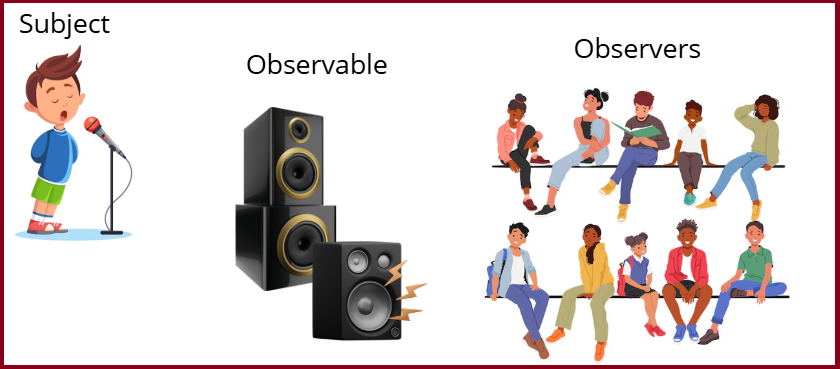

# Angular
Es un framework de código abierto desarrollado por Google para crear aplicaciones web SPA (Single Page Application) en TypeScript.

## 1. Web Site 🌐
[Angular](https://angular.io/)

---
<br>


## 2. Instalación 🛠️
```bash
npm install -g @angular/cli
```
---
<br>


## 3. Instalar Bootstrap 🎨
```bash
npm install bootstrap jquery @popperjs/core
```
- Añadir las rutas de los archivos CSS y JS en el archivo `angular.json`.
```json
"styles": [
  "node_modules/bootstrap/dist/css/bootstrap.min.css",
  "src/styles.css"
],
"scripts": [
  "node_modules/jquery/dist/jquery.min.js",
  "node_modules/@popperjs/core/dist/umd/popper.min.js",
  "node_modules/bootstrap/dist/js/bootstrap.min.js"
]
```
---
<br>


## 4. Angular Material 🎨
Instalar
```bash
ng add @angular/material
```

Añadir las rutas de los archivos CSS (opcional) en el archivo `angular.json`.
```json
"styles": [
  "@angular/material/prebuilt-themes/purple-green.css",
  "node_modules/bootstrap/dist/css/bootstrap.min.css",
  "src/styles.css"
]
```

Importar el módulo de Angular Material en el archivo `app.module.ts`.
```typescript
import { MatButtonModule } from '@angular/material/button';
import { MatCardModule } from '@angular/material/card';

@NgModule({
  imports: [
    MatButtonModule,
    MatCardModule
  ]
})
export class AppModule { }
```

Utilizar los componentes de Angular Material en el HTML.
```html
<button mat-button>Click</button>

<mat-card>  
    <mat-card-title>Hola Mundo</mat-card-title>  
    <mat-card-content>Contenido de la tarjeta</mat-card-content>
</mat-card> 
```
---
<br>


## 5. Instalar extensiones para Visual Studio Code 🔌
- `EsLint`: Herramienta de análisis de código estático para identificar errores y problemas de estilo en el código.
- `Prettier`: Formateador de código que ayuda a mantener un estilo de código consistente.
- `Angular Language Service`: Proporciona autocompletado, navegación y verificación de errores en el código Angular.

Configuración de Prettier y EsLint en el archivo `settings.json` de Visual Studio Code:
```json
"editor.defaultFormatter": "esbenp.prettier-vscode",
"[javascript]": {
  "editor.defaultFormatter": "esbenp.prettier-vscode"
},
"[typescript]": {
  "editor.defaultFormatter": "esbenp.prettier-vscode"
},
"editor.formatOnSave": true
```

Configuración de EsLint en `eslint.config.js`:
```bash
# Instalar EsLint
npm install –g eslint​

# Crear el archivo de configuración (eslint.config.mjs para ES6)
npx eslint --init

# Realiza las siguientes preguntas:
√ How would you like to use ESLint? · problems
√ What type of modules does your project use? · esm
√ Which framework does your project use? · none
√ Does your project use TypeScript? · typescript
√ Where does your code run? · browser
The config that you've selected requires the following dependencies:

eslint, globals, @eslint/js, typescript-eslint
√ Would you like to install them now? · No / Yes
√ Which package manager do you want to use? · npm
```
---
<br>


## 6. Comandos ng 🖥️
```bash
ng --version              # Muestra la versión de Angular CLI
ng new <nombre-proyecto>  # Crea un nuevo proyecto
ng serve                  # Inicia el servidor de desarrollo (--open para abrir el navegador)
ng build                  # Compila la aplicación
ng lint                   # Analiza el código en busca de errores
ng test                   # Ejecuta las pruebas unitarias
ng e2e                    # Ejecuta las pruebas end-to-end

ng generate module <nombre-modulo>         # Crea un nuevo módulo (ng g m mymodule)
ng generate component <nombre-componente>  # Crea un nuevo componente (ng g c mycomponent)
ng generate interface <nombre-interfaz>    # Crea una nueva interfaz (ng g i myinterface)
ng generate service <nombre-servicio>      # Crea un nuevo servicio (ng g s myservice)
ng generate guard <nombre-guardia>         # Crea una nueva guardia (ng g g myguard)
```
- Preguntas durante la creación de un nuevo proyecto:
  - 1ª. ¿Te gustaría habilitar la **autocompletación**?
  - 2ª. ¿Te gustaría compartir datos de uso **pseudónimos** sobre este proyecto con el equipo de Angular en Google bajo la Política de Privacidad de Google?
  - 3ª. ¿Qué formato de **hoja de estilos** te gustaría usar? (CSS, SCSS, SASS, LESS, Stylus).
  - 4ª. ¿Quieres habilitar el **renderizado** del lado del servidor (SSR) y la generación de sitios estáticos (SSG/Prerendering)?
---
<br>


## 7. Estructura 🏗️
```java
/ANGULAR-PROJECT
└─ /.vscode  -- -- -- -- -- -- -- -- -- -- -- - // Configuraciones para Visual Studio Code.
└─ /node_modules  -- -- -- -- -- -- -- -- -- -- // Módulos de Node.js.
└─ /src
|    └─ /app  -- -- -- -- -- -- -- -- -- -- --  // Raíz de los componentes y servicios de Angular.
|    |    └─ /components  -- -- -- -- -- -- --  // Componentes de la aplicación.
|    |    |    └─ navbar  -- -- -- -- -- -- --  // Componente de barra de navegación.
|    |    |    |     └─ navbar.component.ts
|    |    |    |     └─ navbar.component.html
|    |    |    |     └─ navbar.component.scss
|    |    |    |
|    |    |    └─ footer  -- -- -- -- -- -- --  // Componente de pie de página.
|    |    |          └─ footer.component.ts
|    |    |          └─ footer.component.html
|    |    |          └─ footer.component.scss
|    |    |
|    |    └─ /services  -- -- -- -- -- -- -- -- // Servicios para manejar la lógica de negocio.
|    |    |    └─ book.service.ts  -- -- -- --  // Servicio para manejar operaciones de libros.
|    |    |
|    |    └─ /models  -- -- -- -- -- -- -- -- - // Modelos para representar estructuras de datos.
|    |         └─ book.model.ts  -- -- -- -- -- // Modelo de datos para un libro.
|    |
|    └─ /assets  -- -- -- -- -- -- -- -- -- --  // Recursos estáticos como imágenes y estilos.
|
└─ /public
|    └─ /index.html  -- -- -- -- -- -- -- -- -- // Página principal de entrada a la aplicación.
|
└─ /angular.json  -- -- -- -- -- -- -- -- -- -- // Configuración de Angular CLI.
└─ /package.json  -- -- -- -- -- -- -- -- -- -- // Dependencias y scripts de Node.js.
└─ /tsconfig.json  -- -- -- -- -- -- -- -- -- - // Configuración de TypeScript.
└─ /README.md  -- -- -- -- -- -- -- -- -- -- -- // Documentación inicial del proyecto.
└─ /.gitignore  -- -- -- -- -- -- -- -- -- -- - // Archivo para ignorar archivos en git.
└─ /.editorconfig  -- -- -- -- -- -- -- -- -- - // Configuración de estilo de código.
```
---
<br>


## 8. Scripts en package.json 📜
```json
"scripts": {
  "start": "ng serve",
  "build": "ng build",
  "watch": "ng build --watch --configuration development",
   "lint": "ng lint",
   "test": "ng test",
    "e2e": "ng e2e"
}
```
---
<br>


## 9. Módulos 📦
- Es una clase con el decorador `@NgModule`.
- Se utilizaba en versiones anteriores a la 17 para definir los elementos del proyecto (componentes, directivas, pipes, servicios, etc.).
- Se creaba automáticamente el archivo `app.module.ts` al crear un nuevo proyecto.
```typescript
import { NgModule } from '@angular/core';
import { BrowserModule } from '@angular/platform-browser';
import { AppComponent } from './app.component';

@NgModule({
  declarations: [AppComponent],  // Componentes, directivas y pipes.
  imports: [BrowserModule],      // Módulos que necesitamos.
  providers: [],                 // Servicios.
  bootstrap: [AppComponent]      // Componente principal.
})
export class AppModule { }
```
---
<br>


## 10. Componentes 🧩
- Es una clase con el decorador `@Component`.
- Se utiliza para definir la lógica de la vista.
- Se crea automáticamente el archivo `app.component.ts` al crear un nuevo proyecto.
- Se pueden crear tantos como sea necesario.
```typescript
import { Component } from '@angular/core';      // Clase base de los componentes.
import { RouterOutlet } from '@angular/router'; // Clase que se utiliza para mostrar las vistas de las rutas.

@Component({
  selector: 'app-root',                         // Nombre que se usa en el HTML.
  imports: [RouterOutlet],                      // Módulos que necesitamos en el componente.
  templateUrl: './app.component.html',          // Vista del componente.
  styleUrl: './app.component.css'               // Estilos del componente.
})
export class AppComponent {
  title = 'myproject';                          // Propiedad del componente.
}
```
Ciclo de vida de un componente:
1. `ngOnChanges`: Se ejecuta cuando un valor de entrada cambia.
2. `ngOnInit`: Se ejecuta después de que Angular haya mostrado los datos por primera vez.
3. `ngDoCheck`: Se ejecuta cuando Angular comprueba los datos.
4. `ngAfterContentInit`: Se ejecuta después de que Angular haya proyectado el contenido en la vista.
5. `ngAfterContentChecked`: Se ejecuta después de que Angular haya comprobado el contenido proyectado.
6. `ngAfterViewInit`: Se ejecuta después de que Angular haya inicializado la vista.
7. `ngAfterViewChecked`: Se ejecuta después de que Angular haya comprobado la vista.
8. `ngOnDestroy`: Se ejecuta antes de que Angular destruya el componente.
---
<br>


## 11. Data binding 📊
- Es la sincronización de datos entre el modelo y la vista.
```typescript
@Component({
  selector: 'app-root',
  imports: [RouterOutlet, FormsModule], // Importar el módulo FormsModule para poder usar ngModel.
  templateUrl: './app.component.html'
  styleUrl: './app.component.css'
})
export class AppComponent {
  title = 'myproject';
  url = 'https://example.com';
  name = '';
  handler() {
    console.log('Button clicked');
  }
}
```
```html
<p>{{ title }}</p>                             <!-- Interpolación -->
                              <!-- Property binding -->
<button (click)="handler()">Click me</button>  <!-- Event binding -->
<input [(ngModel)]="name">                     <!-- Two-way binding (Requiere importar FormsModule) -->
```
---
<br>


## 12. Directivas 📏
### 12.1. Directivas de atributo
- Son instrucciones en el DOM que cambian el comportamiento de un elemento (ngClass, ngStyle, ngModel).
  - `ngClass`: Añade o elimina clases de un elemento ([ngClass]="{class-name: condition}").
  - `ngStyle`: Añade o elimina estilos de un elemento ([ngStyle]="{style: condition ? value-if-true : value-if-false}").
  - `ngModel`: Enlaza el valor de un input con una propiedad del componente ([(ngModel)]="property").
```html
<!-- ngClass -->
<p [ngClass]="{ 'text-danger': isError, 'text-success': !isError }">Texto</p>

<!-- ngStyle -->
<p [ngStyle]="{ 'color': isError ? 'red' : 'green' }">Texto</p>

<!-- ngModel -->
<input [(ngModel)]="name">
```

### 12.2. Directivas estructurales
- Son instrucciones en el DOM que cambian la estructura del DOM (if, else, switch, for).
- `ng-template`: Es una directiva estructural que se utiliza para definir un bloque de código que se puede reutilizar. Por defecto no se renderiza en el DOM.
- `ng-container`: Es una directiva estructural que se utiliza para agrupar elementos sin añadir un elemento adicional al DOM.
```html
<!-- *ngIf -->
<p *ngIf="isLogged; else noLogged">El usuario está logueado</p>
<ng-template #noLogged>
  <p>El usuario no está logueado</p>
</ng-template>

<!-- @if -->
@if(isLogged) {
  <p>El usuario está logueado</p>
} @else {
  <p>El usuario no está logueado</p>
}

<!-- *ngSwitch -->
<div [ngSwitch]="color">
  <p *ngSwitchCase="'red'">El color es rojo</p>
  <p *ngSwitchCase="'blue'">El color es azul</p>
  <p *ngSwitchDefault>El color es otro</p>
</div>

<!-- @switch -->
@switch(color) {
  @case('red') {
    <p>El color es rojo</p>
  }
  @case('blue') {
    <p>El color es azul</p>
  }
  @default {
    <p>El color es otro</p>
  }
}

<!-- *ngFor -->
<ul>
  <ng-container *ngFor="item of items">
    <li>{{ item.name }}</li>
  </ng-container>
</ul>

<!-- @for -->
<ul>
  @for(item of items; track item.id) {
    <li>{{ item.name }}</li>
  }
  @empty {
    <li>No hay elementos</li>
  }
</ul>
```
---
<br>


## 13. Formularios 📝
### 13.1. Template-driven forms
- Se utilizan para crear formularios simples y rápidos.
- Se gestiona la lógica a través del template HTML.
  - `ngForm`: Directiva que Angular aplica automáticamente a cualquier `<form>`. Permite manejar el estado y las validaciones del formulario.
  - `ngSubmit`:
    - Intercepta el evento submit nativo del navegador.
    - Evita la recarga de página automáticamente.
    - Marca el formulario como enviado (form.submitted = true), lo cual permite mostrar errores sólo al intentar enviar.
    - Ejecuta tu método onSubmit() con el objeto NgForm como argumento.
  - `ngModel`:
    - Registra el campo en el formulario (`NgForm`) automáticamente, siempre que tenga un atributo `name`.
    - Permite que Angular gestione su validación (`required`, `minlength`, etc.).
    - Hace que esté disponible dentro de form.value bajo la clave definida en `name`.


Propiedades del ngForm:

| Propiedad      | Tipo                          | Descripción                                                             |
|----------------|-------------------------------|-------------------------------------------------------------------------|
| `form`         | `FormGroup`                   | Instancia interna del `FormGroup` (rara vez se usa en template-driven). |
| `value`        | `{ [key: string]: any }`      | Valores actuales del formulario (por clave `name` de cada campo).       |
| `controls`     | `{ [key: string]: NgModel }`  | Controles individuales del formulario (por `name`).                     |
| `valid`        | `boolean`                     | `true` si **todos** los controles son válidos.                          |
| `invalid`      | `boolean`                     | `true` si **algún** control es inválido.                                |
| `touched`      | `boolean`                     | `true` si **algún** campo fue tocado (perdió el foco al menos una vez). |
| `untouched`    | `boolean`                     | `true` si **ningún** campo fue tocado.                                  |
| `dirty`        | `boolean`                     | `true` si **algún** valor fue modificado.                               |
| `pristine`     | `boolean`                     | `true` si **ningún** valor fue modificado.                              |
| `disabled`     | `boolean`                     | `true` si el formulario está deshabilitado.                             |
| `enabled`      | `boolean`                     | `true` si el formulario está habilitado.                                |
| `submitted`    | `boolean`                     | `true` si el formulario fue enviado.                                    |
| `pending`      | `boolean`                     | `true` si el formulario está en proceso de envío.                       |

```html
<form #userForm="ngForm" (ngSubmit)="sendUserInfo()">
  <input name="name" type="text" ngModel placeholder="Nombre" required />
  <small *ngIf="userForm.controls['name']?.errors && userForm.controls['name']?.touched">El nombre es requerido</small>
  
  <input name="age" type="number" ngModel placeholder="Edad" required />
  <small *ngIf="userForm.controls['age']?.errors && userForm.controls['age']?.touched">La edad es requerida</small>

  <!-- Botón submit desactivado si el formulario no es válido -->
  <button type="submit" [disabled]="userForm.invalid">Enviar</button>
</form>
```
```typescript
import { Component } from '@angular/core';
import { NgForm } from '@angular/forms';
@Component({
  selector: 'app-root',
  imports: [RouterOutlet, FormsModule],
  templateUrl: './app.component.html',
  styleUrl: './app.component.css'
})

export class AppComponent {
  formValue = null;

  sendUserInfo(userForm: NgForm) {
    this.formValue = userForm.value;
  }
}
```

### 13.2. Reactive forms
- Se utilizan para crear formularios complejos y personalizados.
- Se gestiona la lógica a través del componente TypeScript.
  - `FormBuilder`:
    - Servicio que permite crear FormGroup y FormControl de forma más concisa.
    - Se inyecta en el constructor y se usa como this.formBuilder.group({...}).
  - `FormGroup`:
    - Representa un grupo de controles (FormControl) asociados.
    - Se usa para manejar el estado y validación de todo el formulario.
    - Accesible como una propiedad del componente (this.userForm).
  - `FormControl`:
    - Representa un único campo de formulario.
    - Tiene propiedades como value, valid, touched, dirty, etc.
    - Se define normalmente al construir un FormGroup.
  - `Validators`:
    - Conjunto de funciones de validación: required, min, max, email, etc.
    - Se pasan como segundo parámetro en el array del FormControl.

```html
<form [formGroup]="userForm" (ngSubmit)="sendUserInfo()">
  <input type="text" formControlName="name" placeholder="Nombre" />
  <small *ngIf="validateField('name')">El nombre es obligatorio</small>

  <input type="number" formControlName="age" placeholder="Edad" />
  <small *ngIf="validateField('age')">Edad obligatoria y debe estar entre 18 y 120</small>

  <button type="submit" [disabled]="userForm.invalid">Enviar</button>
</form>
```
```typescript
import { Component } from '@angular/core';
import { FormBuilder, FormGroup, Validators } from '@angular/forms';

@Component({
  selector: 'app-reactive',
  templateUrl: './reactive.component.html',
  styleUrls: ['./reactive.component.scss']
})
export class ReactiveComponent {
  /*---- FormBuilder instancia los FormGroup y FormControl automáticamente. ----
  userForm = new FormGroup({
      name: new FormControl(null, Validators.required),
      age: new FormControl(null, [Validators.required, Validators.min(18), Validators.max(120)])
  });*/
  userForm: FormGroup = this.formBuilder.group({
    name: [null, Validators.required],
    age: [null, [Validators.required, Validators.min(18), Validators.max(120)]]
  });

  formValue: any;

  constructor(private formBuilder: FormBuilder) {}

  sendUserInfo() {
    this.formValue = this.userForm.value;
  }

  validateField(field: string): boolean {
    return this.userForm.controls[field].invalid && this.userForm.controls[field].touched;
  }
}
```
---
<br>
  

## 14. Operators 🧮
### 14.1. Operador ! Non-null assertion operator (Operador de afirmación de no nulidad)
- Se utiliza para indicar a TypeScript que una expresión no será nula o indefinida.
```typescript
let name: string | null = null;
console.log(name!.length);        // No se produce un error de compilación.
```

### 14.2. Operador ? Optional chaining (Encadenamiento opcional)
- Se utiliza para acceder a propiedades de un objeto sin tener que comprobar si el objeto es nulo o indefinido.
```typescript
interface User {
  name: string;
  address?: {                   // Propiedad opcional.
    city: string;               // Si address no existe, address será undefined y city también.
  };
}
```	
```typescript
let user1 = { name: 'John', age: { city: 'New York' } };
let user2 = { name: 'John' };
console.log(user.address?.city);  // New York
console.log(user2.address?.city); // undefined
```
---
<br>


## 15. Comunicación entre componentes 📡
### 15.1. De padre a hijo (@Input)
```typescript
// PADRE
import { Component } from '@angular/core';

@Component({
  selector: 'app-father',
  templateUrl: './father.component.html'
})
export class FatherComponent {
  titleFather = 'myproject';
}
```
```typescript
// HIJO
import { Component, Input } from '@angular/core';

@Component({
  selector: 'app-child',
  templateUrl: './child.component.html'
})
export class ChildComponent {
  @Input() titleFromFather: string;
}
```
```html
<!-- PADRE -->
<app-child [titleFromFather]="titleFather"></app-child>

<!-- HIJO -->
<p>{{ titleFromFather }}</p>
```

### 15.2. De hijo al padre (@Output)
```typescript
// PADRE
import { Component } from '@angular/core';

@Component({
  selector: 'app-father',
  templateUrl: './father.component.html'
})
export class FatherComponent {
  title = 'myproject';
  saludarDesdeElPadre(saludo: string) {
    console.log(saludo);
  }
}
```
```typescript
// HIJO
import { Component, Output, EventEmitter } from '@angular/core';

@Component({
  selector: 'app-child',
  templateUrl: './child.component.html'
})
export class ChildComponent {
  @Output() eventoSaludo = new EventEmitter<string>();
  saludarDesdeElHijo() {
    this.eventoSaludo.emit('Hola desde el hijo');
  }
}
```
```html
<!-- PADRE -->
<app-child (eventoSaludo)="saludarDesdeElPadre($event)"></app-child>

<!-- HIJO -->
<button (click)="saludarDesdeElHijo()">Saludar</button>
```

### 15.3. Desde cualquier componente 
#### 14.3.1. Servicios
- `@Injectable`: Se utiliza para inyectar un servicio en un componente.
```typescript
// SERVICIO
import { Injectable } from '@angular/core';

@Injectable({
  providedIn: 'root'
})
export class DataService {
  data = 'Hola desde el servicio';
}
```
```typescript
// COMPONENTE
import { Component } from '@angular/core';
import { DataService } from './data.service';

@Component({
  selector: 'app-root',
  templateUrl: './app.component.html'
})
export class AppComponent {
  constructor(private dataService: DataService) {}

  ngOnInit() {
    console.log(this.dataService.data);
  }
}
```
<br>


#### 14.3.2. Observables (RxJS)
- El patrón Observer es una forma de comunicación entre componentes en Angular:
  - El Subject emite los valores.
  - El Observable actúa como intermediario entre el Subject y los Observers, emitiendo los valores de forma segura.
  - Los Observers reciben los valores emitidos por el Observable.



- Definiciones:
  - `Observable`: Clase de RxJS que permite trabajar con flujos de datos asíncronos o basados en eventos.
  - `Subject`: Es un tipo de Observable que también actúa como Observer. Permite emitir valores a múltiples observadores.
  - `BehaviorSubject`: Variante de Subject que almacena el último valor emitido y lo proporciona a nuevos suscriptores.
- Métodos:
  - Métodos de Emisión:
     - `next(value: T)`: Emite un valor a los suscriptores.
     - `error(error: Error)`: Emite un error y termina la secuencia.
     - `complete()`: Finaliza la secuencia de emisiones desde el observable.
  - Métodos de Suscripción:
      - `subscribe({next, error, complete}): Subscription`: Suscribe un observador a un observable y devuelve un objeto de tipo **Subscription**.
      - `unsubscribe()`: Cancela la suscripción desde el observador.
  - Métodos de Transformación, Combinación y Filtrado:
      - `pipe(operators)`: Aplica operadores a un observable (map, filter, reduce, scan, switchMap, mergeMap, concatMap, catchError).

```typescript
// SERVICIO
import { Injectable } from '@angular/core';
import { BehaviorSubject } from 'rxjs';

@Injectable({
  providedIn: 'root'
})

export class MsgService {

  private message = new BehaviorSubject<string>('Hola desde el servicio'); // Valor inicial
  message$ = this.message.asObservable();                                  // Observable

  setMessage(text: string) {
    if (text === '') {
      this.message.error('Error: El mensaje no puede estar vacío');        // Emite un error y cancela el observable
    }else{
      this.message.next(text);
    }
  }

  complete() {
    this.message.complete();
  }
}
```
```typescript
// COMPONENTE
import { Component } from '@angular/core';
import { MsgService } from './msg.service';
import { Subscription } from 'rxjs';

@Component({
  selector: 'app-root',
  templateUrl: './app.component.html'
})

export class AppComponent {

 private subscription: Subscription;

 constructor(private msgService: MsgService) {}

  ngOnInit() {
    this.subscription = this.msgService.message$.subscribe({
      next: (msg) => console.log(msg),
      error: (err) => console.log(err),
      complete: () => console.log('Completado')
    });
  }

  changeMessage() {
    this.msgService.setMessage('Hola desde el componente');
  }

  finalize() {
    this.msgService.complete();
  }

  ngOnDestroy() {
    this.subscription.unsubscribe();
  }
}
```
```html
<!-- HMTL -->
<button (click)="changeMessage()">Cambiar mensaje</button>
<button (click)="finalize()">Finalizar</button>
```
```bash
# CONSOLA
Hola desde el servicio
Hola desde el componente
Completado
```
---
<br>

#### 14.3.3. Signals
- `Signal`: Es una nueva forma de manejar el estado en Angular, introducida en **Angular 16**.
- Permite crear y gestionar **estados reactivos** de manera más sencilla y eficiente.
- Los signals pueden ser 
  - `writable` (escribibles): Se crean con la función `signal(initialValue)`.
  - `readonly` (solo lectura): Se crean con la función `computed(getter)` y solo pueden ser leídos.

```html
<!-- signal.component.html -->

<h1 class="text-success text-center">Contador1 (va de uno en uno) {{ contador1() }}</h1>
<h1 class="text-danger text-center">Contador2 (va de dos en dos) {{ contador2() }}</h1>
<h1 class="text-warning text-center">Contador3 (solo lectura de contador1) {{ contador3() }}</h1>
<h1 class="text-info text-center">Contador4 (valor derivado: contador3 * 2) {{ contador4() }}</h1>
<h1 class="text-secondary text-center">Contador5 (valor derivado: contador3 * 2) {{ contador5() }}</h1>

<button class="btn btn-primary" (click)="incrementar()">Incrementar</button>
<button class="btn btn-primary ms-2" (click)="decrementar()">Decrementar</button>
<button class="btn btn-primary ms-2" (click)="resetear()">Resetear</button>
```

```typescript
// signal.component.ts

import { Component, computed, effect, linkedSignal, signal } from '@angular/core';

@Component({
  selector: 'app-signal',
  imports: [],
  templateUrl: './signal.component.html',
  styleUrl: './signal.component.css'
})

export class SignalComponent {
  readonly contador1 = signal(0);                                // readonly solo evita que contador sea reasignado --> contador1≠signal(1)
  readonly contador2 = signal(0);                                // signal() --------> devuelve un WritableSignal
  readonly contador3 = this.contador1.asReadonly();              // asReadonly() ----> devuelve un ReadonlySignal
  readonly contador4 = computed(() => this.contador3() * 2);     // computed() ------> devuelve un ReadonlySignal
  readonly contador5 = linkedSignal(() => this.contador3() * 2); // linkedSignal() --> devuelve un WritableSignal (es igual que computed())

  constructor() {
    // Crear un efecto secundario que actualiza contador2 cuando cambia contador1
    effect(() => {
      this.contador2.set(this.contador1() * 2);
    });
  }

  incrementar() {
    this.contador1.update(value => value + 1);
    this.contador5.update(value => value + 1);

    /* 
    Error: No se puede modificar un ReadonlySignal 
      this.contador3.update(value => value + 1);
      this.contador4.update(value => value + 1);
    */
  }

  decrementar() {
    this.contador1.update(value => value - 1);
    this.contador5.update(value => value - 1);
  }

  resetear() {
    this.contador1.set(0); // Cambia el valor de un WritableSignal
    this.contador2.set(0);
    this.contador5.set(0);

    /* 
    Error: No se puede modificar un ReadonlySignal 
      this.contador3.set(0);
      this.contador4.set(0);
    */
  }
}
```
---
<br>


## 16. Routing 🚦
### 16.1. Routes
- `Routes`: Es un array de objetos que definen las rutas de la aplicación (Las rutas no llevan "/" al principio).
```typescript
// app.routes.ts
import { Routes } from '@angular/router';
import { HomeComponent } from './home.component';
import { ArticlesComponent } from './articles.component';
import { ArticleComponent } from './article.component';
import { ErrorComponent } from './error.component';

export const routes: Routes = [
  { path: '', component: HomeComponent },               // Ruta raíz
  { path: 'articles', component: ArticlesComponent },   // Ruta sin parámetro
  { path: 'article/:id', component: ArticleComponent }, // Ruta con parámetro
  { path: '**', component: ErrorComponent }             // Ruta por defecto
];
```
```html
<!-- app.component.html -->
<router-outlet></router-outlet>
```
<br>

### 16.2. RouterLink
- `RouterLink`: Es una directiva que se utiliza para navegar entre rutas.
```typescript	
// app.component.ts
import { Component } from '@angular/core';
import { RouterOutlet, RouterLink } from '@angular/router';

@Component({
  selector: 'app-root',
  imports: [RouterOutlet, RouterLink],
  templateUrl: './app.component.html',
  styleUrl: './app.component.css'
})
```
```html
<!-- app.component.html -->
<a [routerLink]="['/']">Inicio</a>                      <!-- Ruta raíz ('/')-->
<a [routerLink]="['/articles']">Artículos</a>           <!-- Ruta sin parámetro ('/articles')-->
<a [routerLink]="['/article', 1]">Artículo 1</a>        <!-- Ruta con parámetro ('/article/1')-->

<!-- Ruta con parámetro de consulta ('/article?name=Iphone') -->
<a [routerLink]="['/article']" [queryParams]="{ name: 'Iphone' }">Link</a>
```
<br>

### 16.3. Router
- `Router`: Es un servicio que proporciona métodos para navegar entre rutas.
```typescript
// app.component.ts
import { Component } from '@angular/core';
import { RouterOutlet, Router } from '@angular/router';

@Component({
  selector: 'app-root',
  imports: [RouterOutlet],
  templateUrl: './app.component.html',
  styleUrl: './app.component.css'
})
export class AppComponent {
  constructor(private router: Router) {}

  navigateToArticles() {
    this.router.navigate(['/articles']);
  }

  navigateToArticle(id: number) {
    this.router.navigate(['/article', id]);
  }

  navigateToArticle2() {
    this.router.navigate(['/article/2']);
  }

  navigateToArticleQuery(name: string) {
    this.router.navigate(['/article'], { queryParams: { name } });
  }

  navigatetoIphone() {
    this.router.navigate(['/article'], { queryParams: { name: 'Iphone' } });
  }

  // Si queremos mandar datos a la ruta utilizamos el objeto state
  navigateToArticle(id: number) {
    this.router.navigate(['/article', id], { state: { title: 'Artículo 1' } });
  }

  // Para recibir los datos en la ruta utilizamos el objeto state.
  this.router.getCurrentNavigation().extras.state.title;
  history.state.title; // Se puede acceder desde la API nativa del navegador pero esos datos siempre perduran en el historial.
}
```
```html
<!-- app.component.html -->
<button (click)="navigateToArticles()">Ir a Artículos</button>
<button (click)="navigateToArticle(1)">Ir a Artículo 1</button>
<button (click)="navigateToArticle2()">Ir a Artículo 2</button>
<button (click)="navigateToArticleQuery('Iphone')">Ir a Artículo</button>
<button (click)="navigateToIphone()">Ir a Iphone</button>
```
<br>

### 16.4. ActivatedRoute
- `ActivatedRoute`: Es un servicio que proporciona información sobre la ruta activa.
```typescript
// app.component.ts
import { Component } from '@angular/core';
import { RouterOutlet, ActivatedRoute } from '@angular/router';

@Component({
  selector: 'app-root',
  imports: [RouterOutlet],
  templateUrl: './app.component.html',
  styleUrl: './app.component.css'
})
export class AppComponent {
  constructor(private myroute: ActivatedRoute) {
    this.myroute.params.subscribe(params => console.log(params["id"]));
    this.myroute.queryParams.subscribe(params => console.log(params["name"]));
  }
}
```
<br>

### 16.5. Guards
- `Guards`: Son servicios que se utilizan para proteger las rutas de la aplicación.
  - `CanActivate`: Antes de cargar los componentes de una ruta.
  - `CanActivateChild`: Antes de cargar las rutas hijas.
  - `CanDeactivate`: Antes de salir de una ruta.
  - `CanMatch`: Antes de cargar cualquier ruta.

- `CanActivateFn`: Es una función que devuelve un booleano.
  - `route`: Es un objeto que contiene información sobre la ruta.
    - `url`: Array de segmentos de la URL (['articles', '1']).
    - `params`: Parámetros de la ruta ({ id: 1 }).
    - `queryParams`: Parámetros de consulta ({ name: 'Iphone' }).
    - `fragment`: Fragmento de la URL (Lo que viene después de #).
    - `data`: Datos estáticos de la ruta ({ title: 'Artículo 1' }).
    - `outlet`: Nombre del router-outlet (primary).
    - `routeConfig`: Configuración de la ruta.
    - `parent`: Ruta padre.
    - `firstChild`: Primera ruta hija.
    - `children`: Array de rutas hijas.
  - `state`: Es un objeto que contiene información sobre el estado actual de la navegación.
    - `url`: URL actual.
    - `root`: Ruta raíz.
    - `firstChild`: Primera ruta hija.
    - `children`: Array de rutas hijas.
```typescript
// mi-guardia.guard.ts
import { CanActivateFn } from '@angular/router';
import { inject } from '@angular/core';
import { Router } from '@angular/router';

export const miGuardia: CanActivateFn = (route, state) => {
  if (route.params.id === 1 && state.url === '/articles') {
    return true;
  } else {
    inject(Router).navigate(['/']);
    return false;
  }
};
```
```typescript
// app.routes.ts
import { Routes } from '@angular/router';
import { HomeComponent } from './home.component';
import { ArticlesComponent } from './articles.component';

export const routes: Routes = [
  { path: '', component: HomeComponent },
  { path: 'articles', component: ArticlesComponent, canActivate: [miGuardia] }
];
```
---
<br>


## 17. HTTP Client 🌐
- `HttpClient`: Es un servicio que se utiliza para realizar peticiones HTTP.
- `provideHttpClient`: Es una función que se utiliza para proporcionar el servicio HttpClient y se importa en el archivo de configuración.
```typescript
// app.config.ts
import { ApplicationConfig, provideZoneChangeDetection } from '@angular/core';
import { provideRouter } from '@angular/router';

import { routes } from './app.routes';
import { provideHttpClient } from '@angular/common/http';

export const appConfig: ApplicationConfig = {
  providers: [provideZoneChangeDetection({ eventCoalescing: true }), provideRouter(routes), provideHttpClient()]
};
```

```typescript
// SERVICIO
import { Injectable } from '@angular/core';
import { HttpClient } from '@angular/common/http';
import { Observable } from 'rxjs';

@Injectable({
  providedIn: 'root'
})
export class BookService {

  url: string = 'https://api.example.com/books';

  constructor(private http: HttpClient) {}

  findAll(): Observable<Book[]> {
    return this.http
      .get<Book[]>(this.url)
      .pipe(retry(3), catchError(this.handleError));
  }

  findById(id: number): Observable<Book> {
    return this.http
      .get<Book>(`${this.url}/${id}`)
      .pipe(retry(3), catchError(this.handleError));
  }

  create(book: Book): Observable<Book> {
    return this.http
      .post<Book>(this.url, book)
      .pipe(retry(3), catchError(this.handleError));
  }

  update(id: number, book: Book): Observable<Book> {
    return this.http
      .put<Book>(`${this.url}/${id}`, book)
      .pipe(retry(3), catchError(this.handleError));
  }

  delete(id: number): Observable<Book> {
    return this.http
      .delete<Book>(`${this.url}/${id}`)
      .pipe(retry(3), catchError(this.handleError));
  }

  // Gestión de errores
  private handleError(errorResponse: HttpErrorResponse) {
    if (errorResponse.error instanceof ErrorEvent) {
      // Cliente o errores de red
      return throwError(() => new Error(`Error del cliente: ${errorResponse.error.message}`));
    } else {
      // Errores de HTTP o del servidor
      return throwError(() => new Error(`Error del servidor: ${this.getServerErrorMessage(errorResponse)}`));
    }
  };

  private getServerErrorMessage(errorResponse: HttpErrorResponse): string {
    switch (errorResponse.status) {
      case 400: return 'Solicitud incorrecta (Bad Request)';
      case 401: return 'No autorizado (Unauthorized)';
      case 403: return 'Prohibido (Forbidden)';
      case 404: return 'No encontrado (Not Found)';
      case 500: return 'Error interno del servidor (Internal Server Error)';
      case 502: return 'Bad Gateway';
      default: return errorResponse.status;
    }
  };
}
```
```typescript
// COMPONENTE
import { Component } from '@angular/core';
import { BookService } from './book.service';

@Component({
  selector: 'app-books',
  templateUrl: './books.component.html'
})

export class AppComponent {

  books: Book[] = [];

  constructor(private bookService: BookService) {}

  ngOnInit() {
    this.loadBooks();
  }

  loadBooks(){
    this.bookService.findAll().subscribe({
      next: data => this.books = data,
      error: err => console.log(err),
      complete: () => console.log('Completado')
    });
  }

  createBook(book: Book) {
    this.bookService.create(book).subscribe({
      next: data => this.loadBooks(),
      error: err => console.log(err),
      complete: () => console.log('Completado')
    });
  }

  updateBook(id: number, book: Book) {
    this.bookService.update(id, book).subscribe({
      next: data => this.loadBooks(),
      error: err => console.log(err),
      complete: () => console.log('Completado')
    });
  }

  deleteBook(id: number) {
    this.bookService.delete(id).subscribe({
      next: data => this.loadBooks(),
      error: err => console.log(err),
      complete: () => console.log('Completado')
    });
  }
}
```
---
<br>


## 18. DOM 🌳
- `Renderer2`: Es un servicio que ofrece métodos para manipular elementos del DOM de manera segura, evitando ataques XSS.
- `ElementRef`: Es una clase que se utiliza para acceder a un elemento del DOM.
- `ViewChild`: Es un decorador que se utiliza para acceder a un elemento del DOM.
```html
<!-- HTML -->
<button (click)="changeColor()">Cambiar color</button>
<p #myElement>Este texto cambiará de color</p>
```
```typescript
// COMPONENTE
import { Component, ElementRef, Renderer2, ViewChild } from '@angular/core';

@Component({
  selector: 'app-root',
  templateUrl: './app.component.html'
})
export class AppComponent {

  @ViewChild('myElement') myElement: ElementRef;

  constructor(private renderer: Renderer2) {}

  changeColor() {
    this.renderer.setStyle(this.myElement.nativeElement, 'color', 'red');
  }
}
```
---
<br><br><br>

## *[volver al índice](../../../README.md)*