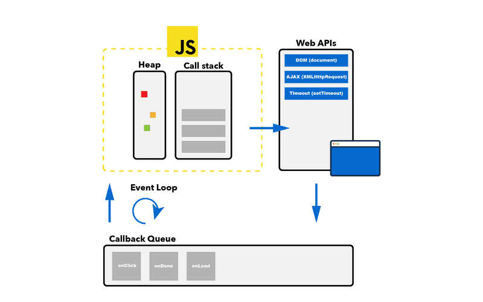

# JavaScript

## 1. Diferencia entre var, let y const
`var`
- Alcance: Function scope (o global si se declara fuera de una función).
- Declaración: Sí
- Reasignación: Sí
```javascript
var x = 1;
if (true) {
    var x = 2;      // Esta es la misma variable x, redeclarada.
    // x = 2;       // Esta es la misma variable x, reasignada.
    console.log(x); // 2
}
console.log(x);     // 2
```

`let`
- Alcance: Block scope.
- Declaración:  Sí, pero no puede ser redeclarada en el mismo bloque.
- Reasignación: Sí
```javascript
let x = 1;
if (true) {
    let x = 2;      // Esta es una nueva variable x, solo accesible dentro del bloque.
    // x = 2;       // Esta es la misma variable x, reasignada.
    console.log(x); // 2
}
// let x = 3;      // Error: Identifier 'x' has already been declared.
console.log(x);    // 1
```

`const`
- Alcance: Block scope.
- Declaración: Sí, pero no puede ser redeclarada en el mismo bloque.
- Reasignación: No
```javascript
const x = 1;
if (true) {
    const x = 2;    // Esta es una nueva variable x, solo accesible dentro del bloque.
    // x = 2;       // Error: Assignment to constant variable.
    console.log(x); // 2
}
// const x = 3;   // Error: Identifier 'x' has already been declared.
console.log(x);   // 1
```
---
<br>

## 2. Template literals
```javascript
let nombre = "Ana";
let saludo = `Hola, ${nombre}!`; // "Hola, Ana!"

let multiLinea = `
  Hola,
  ${nombre}!
`;                               // "Hola,\nAna!"
```
---
<br>

## 3. Comentarios
```javascript
// Comentario de una línea

/*
  Comentario
  de
  varias
  líneas
*/
```
---
<br>

## 4. Operador ternario
```javascript
let edad = 25;
let mensaje = edad >= 18 ? "Eres mayor de edad." : "Eres menor de edad.";
console.log(mensaje); // "Eres mayor de edad."
```
---
<br>

## 5. Arrays
```javascript	
let articulos = ["zapatillas","camisa","calcetines","chaqueta"];
let articulos = new array("zapatillas","camisa","calcetines","chaqueta");

document.write(articulos.length);   // Muestra el tamaño del array.
document.write(articulos[1]);       // Muestra el segundo campo del array.
articulos.push("balón");				    // Agrega un campo al FINAL del array.
articulos.pop();						        // Elimina el ÚLTIMO campo del array.
articulos.push("balón","raqueta");	// Agrega VARIOS campos al FINAL del array.
articulos.unshift("balón");				  // Agrega un campo al INICIO del array.
articulos.shift();						      // Elimina el PRIMER campo del array.
articulos.unshift("balón,raqueta");	// Agrega VARIOS campos al INICIO del array.
```
---
<br>

## 6. Métodos para recorrer arrays
```javascript
let colores = ["rojo", "verde", "azul", "amarillo", "naranja"];
```
### 6.1. forEach()
Ejecuta una función por cada elemento del array.
```javascript
colores.forEach((color, index) => {
    console.log(`${index + 1}. ${color}`);
});
```

### 6.2. map()
Crea un nuevo array con los resultados de la función aplicada a cada elemento del array.
```javascript
let coloresMayusculas = colores.map((color) => color.toUpperCase());
console.log(coloresMayusculas); // ["ROJO", "VERDE", "AZUL", "AMARILLO", "NARANJA"]
```

### 6.3. filter()
Crea un nuevo array con los elementos que cumplen la condición.
```javascript
let coloresCortos = colores.filter((color) => color.length <= 4);
console.log(coloresCortos); // ["rojo", "azul"]
```

### 6.4. find()
Devuelve el primer elemento que cumple la condición.
```javascript
let color = colores.find((color) => color === "verde");
console.log(color); // "verde"
```

### 6.5. reduce()
Aplica una función acumuladora a cada elemento del array, de izquierda a derecha, para reducirlo a un único valor.
```javascript
let numeros = [1, 2, 3, 4, 5];
let suma = numeros.reduce((total, num) => total + num, 0);
console.log(suma); // 15
```
---
<br>

## 7. Objetos
```javascript
let persona = {
    nombre: "Ana",
    edad: 25,
    ciudad: "Madrid"
};

persona.nombre   = "María";    // Añade el campo "nombre" al objeto y si ya existe lo sobreescribe.
persona.[nombre] = "María";    // Añade el campo "nombre" al objeto y si ya existe lo sobreescribe.
```
---
<br>

## 8. Destructuring
```javascript
// Destructuring de arrays
   let colores = ["rojo", "verde", "azul"];
   //let rojo = colores[0];
   //let verde = colores[1];
   //let azul = colores[2];
   let [rojo, verde, azul] = colores; 
   console.log(rojo);   // "rojo"
   console.log(verde);  // "verde"
   console.log(azul);   // "azul"


// Destructuring de objetos
   let persona = { nombre: "Ana", edad: 25 };
   //let nombre = persona.nombre;
   //let edad   = persona.edad;
   let { nombre, edad } = persona;
   console.log(nombre); // "Ana"
   console.log(edad);   // 25
```
---
<br>

## 9. Spread operator
Se utiliza para expandir elementos de un array u objeto en otro array u objeto.
```javascript
// Spread operator en arrays
    let colores = ["rojo", "verde", "azul"];
    let colores2 = ["amarillo", "naranja", ...colores];
    console.log(colores2); // ["amarillo", "naranja", "rojo", "verde", "azul"]

// Spread operator en objetos
    let persona = { nombre: "Ana", edad: 25 };
    let persona2 = { ...persona, ciudad: "Madrid" };
    console.log(persona2); // { nombre: "Ana", edad: 25, ciudad: "Madrid" }
```
---
<br>

## 10. Rest parameter
Permite a una función aceptar un número indefinido de argumentos como un array.
```javascript
function sumar(...numeros) {
    return numeros.reduce((total, num) => total + num, 0);
}

console.log(sumar(1, 2, 3, 4, 5)); // 15
```
---
<br>

## 11. For...in & For...of
- **For...in**: Itera sobre las propiedades de un objeto.
- **For...of**: Itera sobre los elementos de cualquier objeto iterable(array, string, map, set, etc.).
```javascript
// For...in
    let colores = ["rojo", "verde", "azul"];
    for (let index in colores) {
        console.log(colores[index]);
    }

// For...of
    let colores = ["rojo", "verde", "azul"];
    for (let color of colores) {
        console.log(color);
    }
```
---
<br>

## 12. Arrow functions
```javascript
// Función tradicional
    function sumar(a, b) {
      return a + b;
    }

// Arrow function
    let sumar = (a, b) => a + b;
```
---
<br>

## 13. Synchronous vs Asynchronous
- **Synchronous**: El código se ejecuta en secuencia, línea por línea, asegurando que cada operación se complete antes de que comience la siguiente.
- **Asynchronous**: El código asíncrono permite que ciertas operaciones se inicien y se completen en el futuro, sin bloquear la ejecución del código que sigue.
```javascript
// Synchronous
console.log("Primero");
console.log("Segundo");
console.log("Tercero");

// Asynchronous
console.log("Primero");
setTimeout(() => console.log("Tercero"), 1000);
console.log("Segundo");
```

- **¿Cuando se utiliza el código asíncrono?**
  - En operaciones que implican espera, como cargar datos desde una red o acceder a recursos lentos.
  - Para mejorar la eficiencia de la aplicación, permitiendo que múltiples operaciones sucedan al mismo tiempo sin detener la ejecución principal.

- **¿Cómo se maneja el código asíncrono?**
  - Callbacks
  - Promesas
  - Async/await

- **Event Loop:**
  - JavaScript tiene un modelo de concurrencia basado en un "event loop", que permite realizar operaciones de alta intensidad o larga duración sin bloquear el hilo principal.
    - **Event Loop**: Supervisa la pila de ejecución, la cola de tareas pendientes y la cola de callbacks. Mueve los callbacks listos de la cola de callbacks a la pila de ejecución cuando esta última está vacía.
    - **Pila de Callbacks**: También conocida como cola de mensajes, es donde se almacenan los callbacks de operaciones asíncronas hasta que se puedan ejecutar. Los callbacks se ejecutan en el orden en que se completaron, asegurando que el código no se ejecute antes de que se complete la operación a la que está vinculado.
    - **Heap**: Espacio de memoria compartido donde se almacenan los objetos y variables.
    - **Web APIs**: Conjunto de funciones y métodos que permiten realizar operaciones asíncronas, como temporizadores, eventos de usuario, peticiones HTTP, etc.

- **Secuencia de eventos**:
  1. Se ejecuta el código sincrónico sin interrupciones.
  2. Las APIs gestionan las operaciones asíncronas en segundo plano (fetch, setTimeout, etc.)
  3. Se añaden a la cola de eventos (callback queue) las operaciones asíncronas que han finalizado.
  4. El Event Loop supervisa constantemente la pila de ejecución (Call Stack) para verificar si está vacía, ya que debe estarlo para poder pasar al siguiente paso.
  5. Si la pila de ejecución está vacía, el Event Loop mueve el primer callback de la cola de eventos a la pila de ejecución y lo ejecuta.
  6. Se repite el proceso hasta que la cola de eventos esté vacía.



---
<br>

## 14. Callbacks
- Un callback es una función que se pasa como argumento a otra función y se ejecuta después de que ésta termine su ejecución.
- Se utilizan para ejecutar código después de que se haya completado una tarea asíncrona.
- Se pasan sin paréntesis.
```javascript
function saludar(nombre, callback) {
    let edad = callback(1996, 2021);
    console.log(`Hola ${nombre}, tienes ${edad} años.`);
}

function age(birthYear, currentYear) {
    return currentYear - birthYear;
}

saludar("Ana", age); // "Hola Ana, tienes 25 años."
```
---
<br>

## 15. Promesas
- Una promesa es un objeto que representa la finalización o el fracaso de una operación asíncrona.
- Se resuelve con un valor o se rechaza con un error.
- `resolve` y `reject` son sustitutos de return y throw.
```javascript
let promesa = new Promise((resolve, reject) => {
    let exito = true;
    if (exito) {
        resolve("La operación se ha completado con éxito.");
    } else {
        reject("La operación ha fallado.");
    }
});

promesa
    .then((mensaje) => console.log(mensaje))
    .catch((error) => console.error(error));
```
---
<br>

## 16. Async/await
- `async` declara una función asíncrona y la convierte en una promesa.
- `await` pausa la ejecución de la función asíncrona hasta que la promesa se resuelva.
```javascript
// let obtenerDatos = async () => {}
async function obtenerDatos() {
    try {
        let datos = await fetch("https://jsonplaceholder.typicode.com/posts");
        let json = await datos.json(); // Se espera a que se resuelva la promesa.
        return json;
    } catch (error) {
        throw error;
    }
}

obtenerDatos()
  .then((json) => console.log("Datos obtenidos.", json))
  .catch((error) => console.error(error));
```
<br><br><br>

## *[volver al índice](../index.md)*