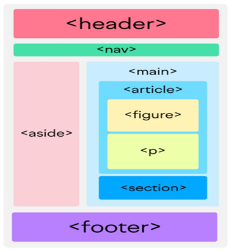
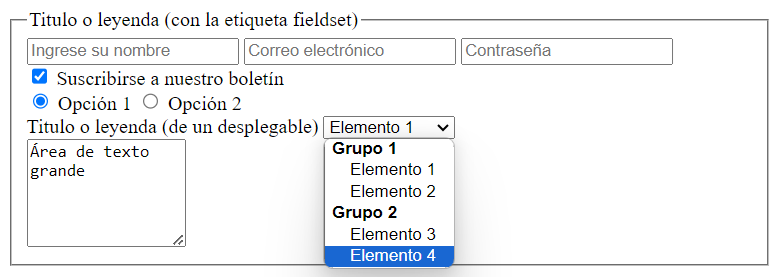

# HTML
## 1. Estructura de un documento HTML5

```html
<!DOCTYPE html>
<html lang="en">

<head>
    <meta charset="UTF-8">
    <meta name="description" content="Resumen del contenido de la página">
    <meta name="viewport" content="width=device-width, initial-scale=1.0">

    <title>Título de la página</title>

    <link rel=stylesheet href="css/estilo.css" type="text/css" />
    <style type="text/css">
        /* Aquí va el CSS */
    </style>

    <script type="text/javascript">
        // Aquí va el JavaScript
    </script>
</head>

<body>
    <header> Cabecera de la página
        <nav>Barra de navegación</nav>
    </header>
    <main>
        <section>
            <figure> 
                
                <figcaption>
                    Este texto es el <b>figcaption</b> de esta imagen
                </figcaption>
            </figure>
            <ol type="a" start="2">
                <li> <span>Ataúlfo (410-415)</span> </li>
                <li> <span>Sigérico (415)</span> </li>
            </ol>
            <a href="http://www.edutopia.es/galeria.html" target="_blank">Galería de Imágenes</a>
            <a href="mailto:jab@jabmultimedia.com">Enviar mail</a>
            <a href="#inicio">Enlace</a>
            <a href="galeria.html#inicio">Enlace</a>
        </section>
        <section>
            <article>Artículo1</article>
            <article>Artículo2</article>
            <article>Artículo3</article>
        </section>
        <aside>Barra lateral</aside>
    </main>
    <footer>Este es el pie de página</footer>
</body>

</html>
```
<br>

## 2. Etiquetas principales
```html
<h1>Títulos(H1, H2, H3, H4, H5, H6)</h1> 
<p>Párrafo</p> 
<pre>Texto preformateado</pre>

<blockquote>Citas</blockquote> <!-- puede utilizar el atributo “cite” -->
<cite>Autor de la cita</cite> 
<code>Código</code>
<dfn>Definiciones</dfn> <!-- <dfn> pueden utilizar el atributo title: Indica el significado completo. -->

<strong>Negrita</strong>
<em>Cursiva</em> 
<mark>Marcado</mark>
<q>“Entrecomillado”</q>
<del>Tachado</del> 
<ins>Subrayado</ins>
<!-- 
<del> e <ins> Se pueden utilizar para indicar que se han realizado cambios utilizando 2 atributos:
    “cite”: Indica la URL de la página en la que se puede obtener más información sobre el motivo por el que se realizó la modificación.
    “datatime”: Especifica la fecha y hora en la que se realizó el cambio.
-->

<sup>Superíndice</sup>  
<sub>Subíndice</sub> 
<small>Pequeño</small> 

</br>Salto de línea 
&nbsp;Espacio en blanco
```
<br>

## 3. Enlaces (links)
```html
<a>Enlaces (links)</a>
<!--
<a> permite utilizar los siguientes atributos:
    name: "texto"              - Permite nombrar al enlace para que se pueda acceder desde otros enlaces.
    href: "url"                - Indica la URL del recurso que se quiere enlazar.
    hreflang: "codigo_idioma"  - Idioma del recurso enlazado.
    type: "tipo_de_contenido"  - Permite "avisar" al navegador sobre el tipo de contenido que se enlaza (imágenes, archivos, etc.) para que pueda preparase en caso de que no entienda ese contenido.
    rel: "tipo_de_relacion"    - Describe la relación del documento actual con el recurso enlazado.
-->
```
### - Códigos de idioma:
| **Código** | **Idioma** | **Variación idiomática** |
|------------|------------|--------------------------|
| **ar**     | árabe      |                          |
| **de**     | alemán     |                          |
| **el**     | griego     |                          |
| **en**     | Inglés     |                          |
| **en-AU**  | Inglés     | Australia                |
| **en-US**  | Inglés     | Estados Unidos           |
| **es**     | Español    |                          |
| **es-AR**  | Español    | Argentina                |
| **es-ES**  | Español    | España                   |
| **es-MX**  | Español    | México                   |
| **fr**     | francés    |                          |
| **he**     | hebreo     |                          |
| **it**     | italiano   |                          |
| **ja**     | japonés    |                          |
| **nl**     | holandés   |                          |
| **pt**     | portugués  |                          |
| **ru**     | ruso       |                          |
| **zh**     | chino      |                          |
<br>

## 4. Codificación de caracteres
### - Caracteres especiales de HTML:
| ENTIDAD  | CARÁCTER          | DESCRIPCION           |
|----------|-------------------|-----------------------|
| `&lt;`   | <                 | less than             |
| `&gt;`   | >                 | more than             |
| `&amp;`  | &                 | ampersand             |
| `&quot;` | "                 | quotation mark        |
| `&nbsp;` | espacio en blanco | non-breaking space    |
| `&apos;` | '                 | apostrophe            |
| `&copy;` | ©                 | copyright             |
| `&reg;`  | ®                 | registered trademark  |
| `&trade;`| ™                 | trademark             |
| `&euro;` | €                 | euro                  |
| `&pound;`| £                 | pound                 |
| `&yen;`  | ¥                 | yen                   |

### - Codificación de caracteres para URL:
| CARÁCTER CODIFICADO | CARÁCTER ORIGINAL   |
|---------------------|---------------------|
| `%2F`               | /                   |
| `%3A`               | :                   |
| `%3D`               | =                   |
| `%22`               | "                   |
| `%27`               | '                   |
| `%20`               | espacio en blanco   |
| `%3F`               | ?                   |
| `%40`               | @                   |
| `%26`               | &                   |
| `%5C`               | \                   |
| `%7E`               | ~                   |
| `%23`               | #                   |
| `%F1`               | ñ                   |
| `%E1`               | á                   |
| `%E9`               | é                   |
| `%ED`               | í                   |
| `%F3`               | ó                   |
| `%FA`               | ú                   |
| `%E7`               | ç                   |
| `%D1`               | Ñ                   |
| `%C1`               | Á                   |
| `%C9`               | É                   |
| `%CD`               | Í                   |
| `%D3`               | Ó                   |
| `%DA`               | Ú                   |
| `%C7`               | Ç                   |
<br>

## 5. Listas
```html
<ul> <!--Listas desordenadas-->
    <li>Elemento 1</li>
    <li>Elemento 2</li>
    <li>Elemento 3</li>
</ul>
<!--
<ul> permite utilizar los siguientes atributos:
    type="disc": Círculo negro.
    type="square": Cuadrado negro.
    type="circle": Círculo blanco.
-->

<ol> <!--Listas ordenadas-->
    <li>Elemento 1</li>
    <li>Elemento 2</li>
    <li>Elemento 3</li>
</ol>
<!--
<ol> permite utilizar los siguientes atributos:
    type="1": Números.
    type="A": Letras mayúsculas.
    type="a": Letras minúsculas.
    type="I": Números romanos grandes.
    type="i": Números romanos pequeños.
-->

<dl> <!--Listas de definición-->
    <dt>Término</dt>
    <dd>Definición</dd>
</dl>
```
<br>

## 6. Imágenes y vídeos de Youtube
```html
 <!--Imágenes-->
<!--
 permite utilizar los siguientes atributos:
    src: "url"                 - Indica la URL de la imagen que se muestra.
    alt: "texto"               - Descripción corta de la imagen.
    name: "texto"              - Nombre del elemento de la imagen.
    height: "unidad de medida" - Indica la altura con la que se debe mostrar la imagen.
    width: "unidad de medida"  - Indica la anchura con la que se debe mostrar la imagen.
-->

<iframe>Videos de YouTube</iframe>

<map>Mapa de imágenes</map> <!-- <map> permite utilizar el atributo name: "texto" – Nombre que identifica de forma única al mapa definido. -->

<area>Imágenes</area>
<!--
    <area> permite utilizar los siguientes atributos:
    href: "url"                             - URL a la que se accede al pinchar sobre el área.
    nohref: "nohref"                        - Se emplea para las áreas que no son seleccionables.
    shape: "default | rect | circle | poly" - Indica el tipo de área que se define (toda la imagen, rectangular, circular o poligonal)
    coords: "lista de números"              - Se trata de una lista de números separados por comas que representan las coordenadas del área Rectangular = X1, Y1, X2, Y2 (coordenadas X e Y del vértice superior izquierdo y coordenadas X e Y del vértice inferior derecho) Circular = X1, Y1, R (coordenadas X e Y del centro y radio del círculo). Poligonal = X1, Y1, X2, Y2,...,XnYn (coordenadas de los vértices del polígono. Si las últimas coordenadas no son iguales que las primeras, se cierra automáticamente el polígono uniendo ambos vértices)
-->
```
<br>

## 7. Tablas
```html
<table border="1">
    <caption>Titulo de la tabla</caption>
    
    <thead>
        <tr>
            <th>Encabezado 1</th>
            <th>Encabezado 2</th>
        </tr>
    </thead>

    <tbody>
        <tr>
            <td>Fila 1, Celda 1</td>
            <td>Fila 1, Celda 2</td>
        </tr>
        <tr>
            <td>Fila 2, Celda 1</td>
            <td>Fila 2, Celda 2</td>
        </tr>
    </tbody>

    <tfoot>
        <tr>
            <td>Fila 3, Celda 1</td>
            <td>Fila 3, Celda 2</td>
        </tr>
    </tfoot>
</table>
<!--
<table> puede utilizar los siguientes atributos:
    border: "numero"                      - Indica el ancho del borde de la tabla.
    width: "unidad de medida"             - Indica el ancho de la tabla.
    height: "unidad de medida"            - Indica la altura de la tabla.
    align: "left | center | right"        - Indica la alineación horizontal de la tabla.
    bgcolor: "color"                      - Indica el color de fondo de la tabla.
    cellspacing: "numero"                 - Indica el espacio entre las celdas.
    cellpadding: "numero"                 - Indica el espacio entre el borde de la celda y su contenido.
    summary: "texto"                      - Descripción de la tabla.

<td> y <th> se pueden utilizar los siguientes atributos:
    abbr: "texto"                         - Permite describir el contenido de la celda.
    headers: "lista de id"                - Indica las celdas que actúan como cabeceras para esta celda
    scope: "col, row, colgroup, rowgroup" - Indica las celdas para las que esta celda será su cabecera
    colspan: "numero"                     - Número de columnas que ocupa esta celda.
    rowspan: "numero"                     - Número de filas que ocupa esta celda.
-->

```
<br>

## 8. Formularios

```html
<form>
    <fieldset> <!-- Marco-->
        <legend>Titulo o leyenda (con la etiqueta fieldset)</legend>

        <input type="text" name="nombre" placeholder="Ingrese su nombre" maxlength="50" required>
        <input type="email" name="correo" placeholder="Correo electrónico" required>
        <input type="password" name="contrasena" placeholder="Contraseña" minlength="8" required>
        <br>

        <input type="checkbox" id="suscripcion" name="suscripcion" checked>
        <label for="suscripcion">Suscribirse a nuestro boletín</label>
        <br>

        <input type="radio" id="opcion1" name="opcion" value="opcion1" checked>
        <label for="opcion1">Opción 1</label>
        <input type="radio" id="opcion2" name="opcion" value="opcion2">
        <label for="opcion2">Opción 2</label>
        <br>

        <label for="">Titulo o leyenda (de un desplegable)</label>
        <select>
            <optgroup label="Grupo 1">
                <option>Elemento 1</option>
                <option>Elemento 2</option>
            </optgroup>
            <optgroup label="Grupo 2">
                <option>Elemento 3</option>
                <option>Elemento 4</option>
            </optgroup>
        </select>
        <br>

        <textarea row="10" cols="10">Área de texto grande</textarea>

        <button type="submit">Enviar</button>
    </fieldset>
</form>
```

`<form>` permite utilizar los siguientes atributos:
| Atributo | Valor                                                       | Descripción                                                                                         |
|----------|-------------------------------------------------------------|-----------------------------------------------------------------------------------------------------|
| `id`     | "identif"                                                   | Representa el id del formulario para hacer referencia a éste desde CSS o scripts.                   |
| `action` | "url"                                                       | Indica la URL donde se enviarán los datos del formulario.                                           |
| `method` | "POST" o "GET"                                              | Especifica el método HTTP que se empleará para enviar los datos.                                    |
| `enctype`| "application/x-www-form-urlencoded" o "multipart/form-data" | Tipo de codificación empleada al enviar el formulario.                                              |
<br>

`<input>` permite utilizar los siguientes atributos:
| Atributo  | Valor                                                      | Descripción                                                                                         |
|-----------|------------------------------------------------------------|-----------------------------------------------------------------------------------------------------|
| alt       | "alt"                                                      | Descripción del control.                                                                            |
| checked   | "checked"                                                  | Para los controles checkbox y radiobutton permite indicar qué opción aparece preseleccionada.       |
| disabled  | "disabled"                                                 | El control aparece deshabilitado y su valor no se envía al servidor junto con el resto de datos.    |
| maxlength | "número"                                                   | Máximo número de caracteres para los controles de texto y de password.                              |
| name      | "name"                                                     | Nombre que identifica al campo de datos.                                                            |
| readonly  | "readonly"                                                 | El contenido del control no se puede modificar.                                                     |
| size      | "unidad de medida"                                         | Tamaño visible del control.                                                                         |
| src       | "url"                                                      | Para el control que permite crear botones con imágenes, indica la URL de la imagen que se emplea.   |
| value     | "texto"                                                    | Valor inicial del control.                                                                          |
| type      | "button / checkbox / color / date / datetime-local / email / file / hidden / image / month / number / password / radio / range / reset / search / submit / tel / text / time / url / week" | Indica el tipo de control que se incluye en el formulario. |
<br>

`<button>` permite utilizar los siguientes atributos:
| Atributo       | Valor                               | Descripción                                                                                                  |
|----------------|-------------------------------------|--------------------------------------------------------------------------------------------------------------|
| autofocus      | "autofocus"                         | Especifica que el botón debería enfocarse automáticamente cuando la página carga.                            |
| disabled       | "disabled"                          | El botón aparece deshabilitado y no se puede interactuar con él.                                             |
| form           | "id_formulario"                     | Especifica el formulario al que el botón está asociado (útil cuando el botón no está dentro del formulario). |
| formaction     | "url"                               | Especifica la URL para el envío del formulario cuando el botón es de tipo "submit".                          |
| formmethod     | "get", "post"                       | Especifica el método HTTP para enviar el formulario, sólo para botones de tipo "submit".                     |
| formnovalidate | "formnovalidate"                    | Indica que el formulario no debe ser validado al ser enviado.                                                |
| formtarget     | "_blank", "_self", "_parent", "_top"| Especifica dónde mostrar la respuesta recibida después de enviar el formulario.                              |
| name           | "name"                              | Nombre que identifica al botón en el envío de formularios.                                                   |
| title          | "texto"                             | Proporciona información adicional sobre el botón, generalmente mostrada como un tooltip.                     |
| type           | "button", "submit", "reset"         | Indica el tipo de botón: normal, de envío de formulario o de reseteo de formulario.                          |
| value          | "texto"                             | Valor que se envía con el formulario si el botón es un botón de envío o un botón de reseteo.                 |


`<label>` permite utilizar los siguientes atributos:
- for: "id del elemento" - Indica la ID del control al que se refiere el rótulo.

`<select>` permite utilizar los siguientes atributos:
- size: "número" - Número de filas que se muestran de la lista.
- multiple: "multiple" - Si se incluye, se permite seleccionar más de un elemento.
- disabled: "disabled" - El control aparece deshabilitado y su valor no se envía al servidor junto con el resto de datos.

`<option>` permite utilizar los siguientes atributos:
- selected: "selected " - Indica si el elemento aparece seleccionado por defecto al cargarse la página.
- value: "texto" - El valor que se envía al servidor cuando el usuario elige esa opción.
- label: "texto" - Permite especificar un rótulo más corto para la opción.

`<optgroup>` permite utilizar el siguiente atributo:
- label: "texto" - Texto que se muestra como título de la agrupación de opciones.  

`<textarea>` permite utilizar los siguientes atributos:
- row: número de filas.
- cols: número de columnas.
<br>

## 9. Etiquetas nuevas de HTML5
```
autocomplete:    //Activa o desactiva (on/off) el auto completado.  
autofocus:       //Fuerza el foco.  
formaction:      //Es la dirección url que se utiliza al activar el elemento.  
formenctype:     //Indica el modo de envío de los datos.  
formnovalidate:  //Indica si el formulario se valida antes de enviarse.  
height           //Altura del elemento tipo image.  
max:             //Valor máximo que se puede entrar en el elemento de datos.  
min:             //Valor mínimo que se puede entrar en el elemento de datos.  
multiple:        //Indica si se permite la selección de valores múltiples.  
pattern:         //Expresión regular que se utiliza para validar entradas de datos.  
placeholder:     //Muestra un texto por defecto en el input.  
required:        //Indica que es un campo obligatorio.  
step:            //Permite establecer la cantidad de valores posibles dentro de un rango.  
width:           //Anchura del elemento tipo image.
```
### - Expresiones regulares con *pattern*:
| EXPRESION REGULAR | CARÁCTER ESPECIAL | DENOMINACIÓN             | DESCRIPCIÓN                                        |
|-------------------|-------------------|--------------------------|----------------------------------------------------|
| `.`               | Punto             | Comodín                  | Cualquier carácter (o texto de tamaño 1)           |
| `A \| B`          | Pipe              | Opciones lógicas         | Opciones alternativas (o A o B)                    |
| `C(A\|B)`         | Paréntesis        | Agrupaciones             | Agrupaciones alternativas (o CA o CB)              |
| `[A-Z]`           |                   | Una letra de la A a la Z |                                                    |
| `[^A-Z]`          | ^ en corchetes    | Rango de exclusión       | Una letra que no sea mayúscula de la A a la Z      |
| `[0-9]`           | Corchetes         | Rangos de caracteres     | Un dígito (del 0 al 9)                             |
| `[0-9]*`          | Asterisco         | Cierre o clausura        | Un dígito repetido 0 o más veces (vacío incluido)  |
| `[0-9]+`          | Signo más         | Cierre positivo          | Un dígito repetido 1 o más veces                   |
| `[0-9]{3}`        | Llaves            | Coincidencia exacta      | Cifra de 3 dígitos (dígito repetido 3 veces)       |
| `[0-9]{2,4}`      | Coincidencia rango|                          | Cifra de 2 a 4 dígitos (repetida de 2 a 4 veces)   |
| `b?`              | Interrogación     | Carácter opcional        | El carácter b puede aparecer o no                  |
| `\\.`             | Barra invertida   | Escape                   | El carácter . literalmente (no como comodín)       |

<br><br><br>

## *[volver al índice](../../index.md)*