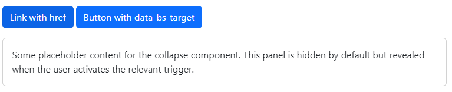

# Bootstrap
Bootstrap es un framework de código abierto para el desarrollo web front-end que proporciona plantillas de diseño con HTML, CSS y JavaScript. Facilita la creación de sitios web responsivos y móviles primero, ofreciendo un amplio rango de componentes preestilizados y plugins para navegación, formularios, botones, y otros elementos de interfaz.

## 1. Instalación
- A través de links:
```html
<link href="https://cdn.jsdelivr.net/npm/bootstrap@5.3.3/dist/css/bootstrap.min.css" rel="stylesheet" integrity="sha384-QWTKZyjpPEjISv5WaRU9OFeRpok6YctnYmDr5pNlyT2bRjXh0JMhjY6hW+ALEwIH" crossorigin="anonymous">
<script src="https://cdn.jsdelivr.net/npm/bootstrap@5.3.3/dist/js/bootstrap.bundle.min.js" integrity="sha384-YvpcrYf0tY3lHB60NNkmXc5s9fDVZLESaAA55NDzOxhy9GkcIdslK1eN7N6jIeHz" crossorigin="anonymous"></script>
```
- Descargando los archivos:
[Bootstrap5](https://github.com/twbs/bootstrap/releases/download/v5.0.2/bootstrap-5.0.2-dist.zip)

---
<br>

## 2. Breakpoints
| Breakpoint         | Class infix | Dimensions |
|--------------------|-------------|------------|
| X-Small            | None        | <576px     |
| Small              | sm          | >=576px    |
| Medium             | md          | >=768px    |
| Large              | lg          | >=992px    |
| Extra large        | xl          | >=1200px   |
| Extra extra large  | xxl         | >=1400px   |
---
<br>

## 3. Containers
| Clase              | Extra small  <576px | Small  ≥576px | Medium  ≥768px | Large  ≥992px | X-Large  ≥1200px | XX-Large  ≥1400px |
|--------------------|---------------------|---------------|----------------|---------------|------------------|-------------------|
| .container         | 100%                | 540px         | 720px          | 960px         | 1140px           | 1320px            |
| .container-sm      | 100%                | 540px         | 720px          | 960px         | 1140px           | 1320px            |
| .container-md      | 100%                | 100%          | 720px          | 960px         | 1140px           | 1320px            |
| .container-lg      | 100%                | 100%          | 100%           | 960px         | 1140px           | 1320px            |
| .container-xl      | 100%                | 100%          | 100%           | 100%          | 1140px           | 1320px            |
| .container-xxl     | 100%                | 100%          | 100%           | 100%          | 100%             | 1320px            |
| .container-fluid   | 100%                | 100%          | 100%           | 100%          | 100%             | 100%              |
---
<br>

## 4. Rejilla (Grid)

```html	
<div class="container"> 
    <div class="row">
        <div class="col-12 col-sm-6 col-md-4 col-lg-3 col-xl-2">
        <div class="col-12 col-sm-6 col-md-4 col-lg-3 col-xl-2">
        <div class="col-12 col-sm-6 col-md-4 col-lg-3 col-xl-2">
        <div class="col-12 col-sm-6 col-md-4 col-lg-3 col-xl-2">
        </div>
    </div>
</div>
```
- **col-12:** En dispositivos extra pequeños (menos de 576px), la columna ocupa el 100% del ancho de la fila (12 de 12 columnas).
- **col-sm-6:** En pantallas pequeñas (≥576px) y mayores, la columna ocupa la mitad del ancho de la fila (6 de 12 columnas).
- **col-md-4:** En pantallas medianas (≥768px), la columna ocupa un tercio del ancho de la fila (4 de 12 columnas), permitiendo 3 columnas por fila.
- **col-lg-3:** En pantallas grandes (≥992px), la columna ocupa un cuarto del ancho de la fila (3 de 12 columnas), permitiendo hasta 4 columnas por fila.
- **col-xl-2:** En pantallas extra grandes (≥1200px), la columna ocupa un sexto del ancho de la fila (2 de 12 columnas), permitiendo hasta 6 columnas por fila.
---
<br>

## 5. Flexbox
Para estructurar la información en una tabla de tres columnas, con una columna central dedicada a las opciones o modificadores de las clases Flexbox en Bootstrap, la organización podría ser la siguiente:

| Clase Base            | Opciones (Modificadores)                                          | Descripción                                                           |
|-----------------------|-------------------------------------------------------------------|-----------------------------------------------------------------------|
| **d-flex**            | -                                                                 | Activa display flex en el contenedor.                                 |
| **flex-row**          | -                                                                 | Dirección de los ítems en horizontal.                                 |
| **flex-column**       | -                                                                 | Dirección de los ítems en vertical.                                   |
| **flex-wrap**         | -                                                                 | Permite la envoltura de ítems.                                        |
| **justify-content-**  | `-start`, `-end`, `-center`, `-between`,<br>`-around`, `-evenly`  | Justifica el contenido de diferentes maneras.                         |
| **align-items-**      | `-start`, `-end`, `-center`, `-baseline`,<br>`-stretch`           | Alinea ítems verticalmente de diferentes maneras.                     |
| **align-content-**    | `-start`, `-end`, `-center`, `-between`,<br>`-around`, `-stretch` | Alinea líneas de contenido en el contenedor cuando hay espacio extra. |
| **align-self-**       | `-start`, `-end`, `-center`, `-baseline`,<br>`-stretch`           | Permite la alineación individual de un ítem flex.                     |
| **order**             | (número)                                                          | Controla el orden de los ítems flex.                                  |
| **flex-grow**         | (número)                                                          | Controla la capacidad de crecimiento del ítem.                        |
| **flex-shrink**       | (número)                                                          | Controla la capacidad de encogimiento del ítem.                       |
| **flex-basis**        | (valor)                                                           | Define la dimensión inicial del ítem.                                 |
| **flex**              | (valor)                                                           | Shorthand para `flex-grow`, `flex-shrink`, y `flex-basis`.            |
| **flex-fill**         | -                                                                 | Hace que el ítem flex ocupe todo el espacio disponible.               |
---
<br>

## 6. Colores
### 6.1. Backgrounds


### 6.2. Text


---
<br>

# 7. Modelo de la caja
### 7.1. Margen y padding
- `m-10:` Margin 10 en todas las direcciones.
- `mt0:` Margin top 0.
- `mb1:` Margin bottom 1.
- `ml2:` Margin left 2.
- `mr3:` Margin right 3.
- `p-10:` Padding 10 en todas las direcciones.
- `pt0:` Padding top 0.
- `pb1:` Padding bottom 1.
- `pl2:` Padding left 2.
- `pr3:` Padding right 3.

### 7.2. Bordes
- `border:` Borde de 1px sólido en todas las direcciones.
- `border-0:` Sin borde.
- `border-top:` Borde superior de 1px sólido.
- `border-bottom:` Borde inferior de 1px sólido.
- `border-left:` Borde izquierdo de 1px sólido.
- `border-right:` Borde derecho de 1px sólido.
- `border-primary:` Borde de color primario.

### 7.3. Radios
- `rounded:` Bordes redondeados.
- `rounded-0:` Bordes cuadrados.
- `rounded-top:` Bordes redondeados en la parte superior.
- `rounded-bottom:` Bordes redondeados en la parte inferior.
- `rounded-circle:` Bordes redondeados en forma de círculo.
- `rounded-pill:` Bordes redondeados en forma de píldora.

### 7.4. Overflow
- `overflow-auto:` Scroll automático.
- `overflow-hidden:` Ocultar contenido que desborda.
- `overflow-visible:` Mostrar contenido que desborda.
- `overflow-scroll:` Scroll en todas las direcciones.
- `overflow-x-auto:` Scroll horizontal automático.
- `overflow-y-auto:` Scroll vertical automático.

### 7.5. Posicionamiento
- `position-static:` Posición estática.
- `position-relative:` Posición relativa.
- `position-absolute:` Posición absoluta.
- `position-fixed:` Posición fija.
- `position-sticky:` Posición pegajosa.

### 7.6. Visibilidad
- `visible:` Visible.
- `invisible:` Invisible.

### 7.7. Opacidad
- `opacity-0:` Opacidad 0.
- `opacity-25:` Opacidad 0.25.

### 7.8. Z-index
- `z-index-0:` Z-index 0.
- `z-index-1:` Z-index 1.

### 7.9. Cursor
- `cursor-pointer:` Cursor de tipo puntero.
- `cursor-not-allowed:` Cursor de tipo no permitido.
---
<br>

## 8. Componentes
### 8.1. Navbar
Barra de navegación que se adapta a los distintos tamaños de pantalla.
```html
<nav class="navbar navbar-expand-lg" ></nav>
```


### 8.2. Offcanvas
Es un componente de tipo sidebar que nos permite mostrar/ocultar su contenido desde cualquier lado de la pantalla (start, end, top, bottom)
```html
<div class="offcanvas offcanvas-start">
    <div class="offcanvas-header">
    <div class="offcanvas-body">
    <div class="offcanvas-footer">
</div>
```

### 8.3. Dropdown, Collapse y Accordion
Dropdown: Menú desplegable.
Collapse: Contenido colapsable.
Accordion: Grupo de collapse.
```html
<div class="dropdown">
    <ul class="dropdown-menu">
        <li class="dropdown-item">
        <li class="dropdown-item">
        <li class="dropdown-item">
    </ul>
</div>
```


```html
<div class="collapse">
    <div class="collapse show">
    <div class="collapse">
</div>
```


```html
<div class="accordion">
    <div class="accordion-item">
        <h2 class="accordion-header">
            <button class="accordion-button">
        </h2>
        <div class="accordion-collapse">
    </div>
</div>
```


### 8.4. Modal, Popover, Tooltip y Toast
Modal: Ventana emergente.
Popover: Ventana emergente con contenido.
Tooltip: Mensaje emergente.
Toast: Mensaje emergente.
```html
<div class="modal">
    <div class="modal-dialog">
        <div class="modal-content">
            <div class="modal-header">
            <div class="modal-body
            <div class="modal-footer">
        </div>
    </div>
</div>
```


```html	
<div class="popover">
    <div class="popover-header">
    <div class="popover-body">
</div>
```


```html
<div class="tooltip">
    <div class="tooltip-inner">
</div>
```


```html
<div class="toast">
    <div class="toast-header">
    <div class="toast-body">
</div>
```


### 8.5. Carousel
Carrusel de imágenes.
```html
<div id="carouselExampleControls" class="carousel slide">
    <div class="carousel-inner">
        <div class="carousel-item">
        <div class="carousel-item">
        <div class="carousel-item">
    </div>
    <button class="carousel-control-prev">
    <button class="carousel-control-next">
</div>
```


### 8.6. Heroes
Sección de contenido con imagen de fondo.
```html
<div class="hero">
    <div class="hero-body">
        <h1 class="hero-title">
        <p class="hero-text">
    </div>
</div>

<div class="hero hero-lg">
    <div class="hero-body">
        <h1 class="hero-title
        <p class="hero-text">
    </div>
</div>
```
---
<br>

## 9. Formularios
### 9.1. Labels e Inputs
```html
<form>
    <label for="input" class="form-label">Nombre</label>
    <input type="text" id="input" class="form-control">

    <div class="input-group">
        <span class="input-group-text">@</span>
        <input type="email" id="input" class="form-control">
    </div>
</form>
```

### 9.2. Selects
```html
<form>
    <label for="select" class="form-label">País</label>
    <select id="select" class="form-select">
        <option value="1">España</option>
        <option value="2">México</option>
        <option value="3">Argentina</option>
    </select>
</form>
```

### 9.3. Checkboxes y Radio Buttons
```html
<form>
    <div class="form-check form-check-inline">
        <input type="checkbox" id="checkbox" class="form-check-input">
        <label for="checkbox" class="form-check-label">Acepto los términos y condiciones</label>
    </div>

    <div class="form-check form-switch">
        <input type="checkbox" id="checkbox" class="form-check-input">
        <label for="checkbox" class="form-check-label">Modo oscuro</label>
    </div>
</form>
```

### 9.4. Botones

```html
<button class="btn btn-primary">Primary</button>
<button class="btn btn-secondary">Secondary</button>
<button class="btn btn-success">Success</button>
<button class="btn btn-danger">Danger</button>
<button class="btn btn-default">Default</button>
<button class="btn btn-info">Info</button>
<button class="btn btn-warning">Warning</button>
<button class="btn btn-light">Light</button>
<button class="btn btn-dark">Dark</button>
<button class="btn btn-link">Link</button>
```
---
<br><br><br>

## *[volver al índice](../../../index.md)*