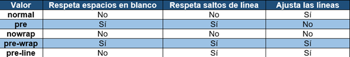

# CSS
## 1. Incluir CSS en HTML
### A. Inline:
Se inserta el código CSS en un elemento HTML.
```html
<p style="color: blue; font-family: Arial;">Un párrafo de texto con estilo directo en el elemento.</p>
```

### B. Interno:
Se incluye el código CSS en el mismo documento HTML.
```html
<head>
    <meta http-equiv="Content-Type" content="text/html; charset=iso-8859-1" />
    <title>Ejemplo de estilos CSS en el propio documento</title>
    <style type="text/css">
        p { color: black; font-family: Verdana; }
    </style>
</head>
<body>
    <p>Un párrafo de texto.</p>
</body>
```

### C. Externo:
Se define el código CSS en un archivo externo.
```html
<head>
    <meta http-equiv="Content-Type" content="text/html; charset=iso-8859-1" />
    <title>Ejemplo de estilos CSS en un archivo externo</title>
    <link rel="stylesheet" type="text/css" href="/css/estilos.css" media="screen" />
</head>
<body>
    <p>Un párrafo de texto.</p>
</body>
```
<br>

## 2. Selectores
### A. Selectores simples:
```css
/* Todos los elementos de tipo "p" con atributo class="aviso" */
p.aviso { ... }

/* Todos los elementos de tipo "p" con atributos class="aviso especial" */
p.aviso.especial { ... }

/* Todos los elementos con atributo class="aviso especial" q estén dentro de un "p" */
p .aviso.especial { ... }

/* Todos los elementos de tipo "p" con atributo id="aviso" */
p#aviso { ... }

/* Todos los elementos con atributo id="aviso" que estén dentro de un "p" */
p #aviso { ... }

/* Todos los elementos "p" y todos los elementos con atributo id="aviso" */
p, #aviso { ... }

/* Todos los elementos "p" cuyos hijos (no nietos) sean elementos “span" */
p > span { ... }

/* Todos los elementos "h1" cuyo hermano adyacente (mismo padre) sea un “h2" */
h1 + h2 { ... }

/* Todos los elementos "h1" cuyo hermano (mismo padre) sea el elemento “h2" y no es necesario que sea adyacente a este, pero sí que sea posterior*/
h1 ~ h2 { ... }
```

### B. Selector de atributos:
```css
/* Se muestran de color azul todos los enlaces que tengan un atributo "class", independientemente de su valor */
a[class] { color: blue; }

/* Se muestran de color azul todos los enlaces que tengan un atributo "class" con el valor "externo" */
a[class="externo"] { color: blue; }

/* Se muestran de color azul todos los enlaces que apunten al sitio http://www.ejemplo.com */
a[href="http://www.ejemplo.com"] { color: blue; }

/* Se muestran de color azul todos los enlaces que tengan un atributo "class" con el valor que empiece por "externo" */
a[class^="externo"] { color: blue; }

/* Se muestran de color azul todos los enlaces que tengan un atributo "class" con el valor que termine por "externo" */
a[class$="externo"] { color: blue; }

/* Se muestran de color azul todos los enlaces que tengan un atributo "class" en el que al menos uno de sus valores sea "externo" (palabra completa) */
a[class~="externo"] { color: blue; }

/* Se muestran de color azul todos los enlaces que tengan un atributo "class" en el que se encuentre la subcadena "exter" (palabra completa) */
a[class*="exter"] { color: blue; }

/* Selecciona todos los elementos de la página cuyo atributo "lang" sea igual a "en", es decir, todos los elementos en inglés */
*[lang=en] { ... }

/* Selecciona todos los elementos de la página cuyo atributo "lang" empiece por "es", es decir, "es", "es-ES", "es-AR", etc. */
*[lang|="es"] { color : red }
```

### C. Pseudo selectores:
#### - Pseudo-clases
```css
:active {}              /*estilos a enlaces que está pinchando el usuario.*/
:checked {}             /*estilos a elementos de tipo checkbox o radio que esté marcado.*/
:focus {}               /*estilos a campos donde esté el foco y no solo el puntero.*/
:hover {}               /*estilos a enlaces posicionado el puntero del ratón.*/
:link {}                /*estilos a enlaces que aún NO han sido visitados.*/
:valid {}               /*estilos a campos válidos (normalmente formularios).*/
:invalid {}             /*estilos a campos inválidos (normalmente formularios).*/
:visited {}             /*estilos a enlaces que SÍ han sido visitados.*/
:target {}              /*estilos al objetivo de un enlace.*/

:first-child {}         /*Selecciona el primer hijo de un elemento.*/
:last-child {}          /*Selecciona el último hijo de un elemento.*/
:nth-child(n) {}        /*Selecciona el enésimo hijo de un elemento.*/
:nth-last-child(n) {}   /*Selecciona el enésimo hijo de un elemento, contando desde el último.*/

:first-of-type {}       /*Selecciona el primer elemento de su tipo entre los hijos de su elemento padre.*/
:last-of-type {}        /*Selecciona el último elemento de su tipo entre los hijos de su elemento padre.*/
:nth-of-type(n) {}      /*Selecciona el enésimo elemento de su tipo.*/
:nth-last-of-type(n) {} /*Selecciona el enésimo elemento de su tipo, contando desde el último.*/
```

#### - Pseudo-elementos
```css
::first-line {}         /*Selecciona la primera línea de un bloque de texto.*/
::first-letter {}       /*Selecciona la primera letra de un bloque de texto.*/
::before {}             /*Inserta contenido antes del contenido de un elemento.*/
::after {}              /*Inserta contenido después del contenido de un elemento.*/
::selection {}          /*Selecciona la porción de un elemento que ha sido seleccionada por el usuario.*/

/***before, after y selection llevan: {content: “”}*/
```
<br>

## 3. Unidades
### A. Relativas:
```css
rem   /*Relativo al tamaño de fuente del elemento raíz (html)*/
em    /*Relativo al tamaño de fuente del elemento padre*/

vw    /*Porcentaje del ancho de la ventana de visualización*/
vh    /*Porcentaje de la altura de la ventana de visualización*/

ch    /*Ancho del carácter "0" del tipo de letra actual*/
ex    /*Altura de la letra "x" del tipo de letra actual*/

%     /*Porcentaje relativo al valor de la propiedad del elemento padre*/
```
### B. Absolutas:
```css
px    /*pixeles*/
in    /*pulgadas*/
cm    /*centímetros*/
mm    /*milímetros*/
pt    /*1 punto (0.35mm)*/
pc    /*1 pica (4.23mm)*/
```
<br>

## 4. Tamaño
```css
div{
    width: 200px;      /*Anchura*/
    max-width:200px;   /*Anchura máxima*/
    min-width: 100px;  /*Anchura mínima*/
    
    height: 400px;     /*Altura*/
    max-height: 400px; /*Altura máxima*/
    min-height: 200px; /*Altura mínima*/
}
```
<br>

## 5. Bordes
```css
div{
    outline: 1px solid red;    /*Contorno: línea exterior (ancho estilo color)*/

    border: 1px solid red;     /*medida color estilo*/
    border-top: 1px;
    border-right: 1px;
    border-bottom: 1px;
    border-left: 1px;

    border-width: 1px;         /*medida ó (thin medium thick)*/
    border-top-width: 10px;
    border-right-width: 1em;
    border-bottom-width: thick;
    border-left-width: thin;

    border-color: red;
    border-top-color: #CC0000;
    border-right-color: blue;
    border-bottom-color: #00FF00;
    border-left-color: #CCC;

    border-style: none;        /*none hidden dotted dashed solid double groove ridge inset outset*/
    border-top-style: dashed;
    border-right-style: double;
    border-bottom-style: dotted;
    border-left-style: solid;
}
```

<br>

## 6. Margen y relleno
```css
div{
    margin: .5em .5em .5em 1em;    /*margen*/
    margin-top: .5em;
    margin-bottom: .5em;
    margin-left: 1em;
    margin-right: .5em;

    padding: .5em .5em .5em 1em;   /*relleno*/
    padding-top: .5em;
    padding-bottom: .5em;
    padding-left: 1em;
    padding-right: .5em;
}
```
<br>

## 7. Fondos
```css
div{
    background: #222d2d url(./graphics/colorstrip.gif) repeat-x 0 0; /*background-color background-image background-repeat background-attachment background-position*/
    
    background-color: #F5F5F5;                   /*color de fondo*/
    background-image: url("imagenes/fondo.png"); /*imagen de fondo*/
    background-repeat: repeat-x;                 /*repite en horizontal*/
    background-repeat: repeat-y;                 /*repite en vertical*/
    background-position: left top;               /*posición de la imagen de fondo (left | center | right) (top | center | bottom)*/
    background-attachment: scroll;               /*se desplaza*/
    background-attachment: fixed;                /*fija*/
}
```
<br>

## 8. Tipografía
```css
div{
    font-style: italic;               /*cursiva (normal | italic | oblique)*/
    font-variant: small-caps;         /*mayúsculas pequeñas (normal | italic | oblique)*/
    font-weight: bold;                /*neregita (normal | bold | bolder | lighter | 100 | 200 | 300 | 400 | 500 | 600 | 700 | 800 | 900)*/
    font-family: “Arial”, sans-serif; /*tipo de letra*/
    font-size: 16px;                  /*tamaño*/
}
```

<br>

## 9. Colores
```css
div{
    color: red;                     /*Con nombre*/
    color: #FF000080;               /*Hexadecimal (2 últimos dígitos es la opacidad*/
    color: rgba(255, 0, 0, 0.5);    /*RGBA (Red, Green, Blue, Alpha)*/
    color: hsla(0, 100%, 50%, 0.5); /*HSLA (Hue, Saturation, Lightness, Alpha)*/
}
```

<br>

## 10. Texto
```css
div{
    line-height: 2;                /*Interlineado (normal | <numero> | <medida> | <porcentaje>)*/
    text-decoration: underline;    /*Subrayado (none | underline | overline | line-through | blink)*/
    text-transform: uppercase;     /*Mayúsculas (capitalize | uppercase | lowercase | none)*/
    text-indent: 2%;               /*Tabulación*/
    letter-spacing: 2%;            /*Espaciado entre letras*/
    word-spacing: 2%;              /*Espaciado entre palabras*/
    white-space: pre;              /*Tratamiento de los espacios en blanco*/
}
```

```css
div{
    text-align: center;            /*Alineación del texto (left | right | center | justify)*/
    vertical-align: super;         /*Alineación vertical (baseline | sub | super | top | text-top | middle | bottom | text-bottom | <porcentaje> | <medida>)*/
}
``` 

<br>

## 11. Listas
```css
div{
    list-style-type: circle;       /*Tipo de lista (disc | circle | square | decimal |decimal-leading-zero | lower-roman | upper-roman | lower-greek | lower-latin | upper-latin | armenian | georgian | lower-alpha | upper-alpha | none)*/
    list-style-position: outside;  /*Posición (inside | outside)*/
    list-style-image: url(img.jpg) /*Imagen (<url> | none)*/
}
```

<br>

## 12. Posicionamiento
`static`: El elemento se posicionan según el flujo normal del documento (Valor por defecto).  
`relative`: El elemento se mueve con: _top_, _right_, _bottom_ y _left_ respecto de sí mismo.  
`absolute`: El elemento se mueve con: _top_, _right_, _bottom_ y _left_ respecto de su primer ancestro posicionado (no static), sacándolo del flujo del documento.  
`fixed`: El elemento permanece fijo durante el desplazamiento de la página.  
`sticky`: El elemento se comporta como relative hasta que alcanza un punto de desplazamiento específico, momento en el cual se convierte en fixed.
```css
div{
    position: static;   /*Posicionamiento (static | relative | absolute | fixed)*/
    
    top: 10px;
    right: 10px;
    bottom: 10px;
    left: 10px;

    float: left;        /*Posicionamiento float (left | right | none)*/
    clear: both;        /*Despejar los elementos flotantes adyacentes (left | right | both | none)*/

    /* Block permite margen y padding, inline solo horizontalmente. Para eso utilizamos inline-block */
    display: inline;    /*visualización de un elemento (inline | block | none | list-item | run-in | inline-block | table | inline-table | table-row-group | table-header-group | table-footer-group | table-row | table-column-group | table-column | table-cell | table-caption)*/
    visibility: hidden; /*Visibilidad de un elemento (visible | hidden | collapse)*/
    overflow: scroll;   /*Parte sobrante de un elemento (visible | hidden | scroll | auto)*/
    z-index: auto;      /*Orden tridimensional (auto | <número>)*/
}
```
<br>

### - Display:

#### A. none:
- Hace que el elemento **NO SE MUESTRE** en absoluto.
- El elemento y sus hijos **NO OCUPARÁN ESPACIO** en el diseño, como si no existieran.

#### B. block:
- Hace que el elemento ocupe **TODO EL ANCHO DISPONIBLE**, independientemente de su contenido.
- Siempre comienza en una nueva línea.
- Puede tener márgenes y rellenos.
- Ejemplos: div, p, h1, h2, h3, h4, h5, h6, ol, ul, li, table, form.

#### C. inline:
- Hace que el elemento **OCUPE SOLO EL ANCHO DE SU CONTENIDO**.
- No puede tener márgenes verticales pero sí rellenos.
- No puede tener un ancho o alto especificado.
- Ejemplos: span, a, strong, em, img, input, select, textarea.

#### D. inline-block:
- Combina las características de los elementos block e inline.
- Hace que el elemento **OCUPE SOLO EL ANCHO DE SU CONTENIDO** (inline).
- Puede tener márgenes y rellenos (block).
- Puede tener un ancho y alto especificado (block).
- Ejemplos: button, input, select, textarea.

#### E. [flex:](./flex.md)
- Hace que el elemento se comporte como un contenedor flexible.
- Los elementos hijos pueden ser flexibles o no.
- Los elementos hijos se pueden alinear horizontal y verticalmente.


#### F. [grid:](./grid.md)
- Hace que el elemento se comporte como un contenedor de cuadrícula.
- Los elementos hijos se pueden colocar en filas y columnas.


#### G. table:
- Hace que el elemento se comporte como una tabla de HTML.
- Los elementos hijos se comportan como celdas de tabla.
<br><br>


## 13. Reglas @ (At-rules)
`@import`: Se utiliza para importar estilos desde otros archivos CSS.  
`@media`: Permite aplicar estilos condicionales dependiendo de las características del dispositivo, como su tamaño de pantalla o resolución.  
`@font-face`: Se utiliza para definir y cargar fuentes personalizadas.  
`@keyframes`: Define animaciones con nombre para ser utilizadas con la propiedad animation.  
`@supports`: Permite aplicar estilos condicionales basados en si el navegador soporta ciertas propiedades o valores de CSS.  
`@page`: Se utiliza en estilos para documentos impresos, especificando cómo se deben estilizar las páginas cuando se imprimen.
```css
/* Primero, importar un archivo CSS externo */
@import url("path/to/your/stylesheet.css");

/* Luego, definir una fuente personalizada */
@font-face {
    font-family: "MiFuentePersonalizada";
    src: url("path/to/font-regular.woff2") format("woff2");
    font-weight: normal; /* o 400 */
}
```
<br>

## 14. Resposive Web Design
Lo primero es utilizar una etiqueta HTML5 para que el navegador sepa que el sitio web es responsive.
```html
<meta name="viewport" content="width=device-width, initial-scale=1.0">
```
Se utiliza la propiedad `@media` para aplicar estilos condicionales:
- **print**: Estilos para dispositivos al imprimir.
- **screen**: Estilos para dispositivos con pantalla.
- **speech**: Estilos para dispositivos que convierten texto en voz.
- **all**: Estilos para todos los dispositivos.

Operadores lógicos:
- **and**: Se aplican los estilos si se cumplen todas las condiciones.
- **not**: Se aplican los estilos si no se cumple la condición.
- **,**: Se aplican los estilos si se cumple alguna de las condiciones.
- **only**: Se aplican los estilos si se cumple la condición y no se cumple ninguna otra.

```css
/*Estilos para dispositivos al imprimir con un ancho de pantalla entre 600px y 900px*/
@media print and (min-width: 600px) and (max-width: 900px) {
    body {
        background-color: lightyellow;
    }
}

/*Estilos para dispositivos con una resolución de pantalla entre 300dpi y 600dpi*/
@media screen and (min-resolution: 300dpi) and (max-resolution: 600dpi){
    body {
        background-color: lightpink;
    }
}

/*Estilos para dispositivos con una relación de aspecto de 16:9 y orientación horizontal o aspecto de 4:3 y orientación vertical*/
@media all and (min-aspect-ratio: 16/9) and (orientation: landscape), screen and (min-aspect-ratio: 4/3) and (orientation: portrait){
    body {
        background-color: lightgreen;
    }
}
```
<br>

## 15. Variables
### A. Globales:
```css
:root {
    --color: #007bff; /* Azul */
    --espaciado: 8px; /* Espaciado estándar */
    --fuente: 'Roboto', sans-serif; /* Fuente Roboto */
}

body {
    color: var(--color);
    font-family: var(--fuente);
    padding: var(--espaciado);
}
```
### B. Locales:
```css
.contenedor {
    --color: #007bff; /* Azul */
    --espaciado: 8px; /* Espaciado estándar */
    --fuente: 'Roboto', sans-serif; /* Fuente Roboto */
}

.contenedor {
    color: var(--color);
    font-family: var(--fuente);
    padding: var(--espaciado);
}
```
<br>

## 16. Animaciones
### A. From-To:
```css
@keyframes fromTo { 
    from { 
        background-color: red;
        color: white;
    }
    to { 
        background-color: yellow; 
        color: black;
    }
}
```
### B. Porcentajes:
```css
@keyframes porcentajes {
    0% { background-color: red; }
    25% { background-color: yellow; }
    50% { background-color: blue; }
    75% { background-color: green; }
    100% { background-color: red; }
}
```
### C. Transform:
```css
@keyframes withTransform {
    0% { 
        transform: scale(1);                 /*Rotate(grados)*/
        transform: rotate(0deg);             /*Scale(factor)*/
        transform: translate(0, 0);          /*Translate(x, y)*/
        transform: skewX(0deg);              /*SkewX(grados)*/
        transform: skewY(0deg);              /*SkewY(grados)*/
    }
    50% { 
        transform: scale(1.5); 
        transform: rotate(180deg);
        transform: translate(50px, 50px);
        transform: skew(30deg, 30deg);       /*Skew(gradosX, gradosY)*/

        /*Se puede hacer en una sola línea*/
        transform: scale(1.5) rotate(180deg) translate(50px, 50px) skew(30deg, 30deg);
    }
    100% { 
        transform: matrix(1, 0, 0, 1, 0, 0); /* Matrix(scaleX, skewY, skewX, scaleY, translateX, translateY) */
    }
}
```
### D. Transition:
```css
div {
    transition-property: background-color;  /* Propiedad a animar */
    transition-duration: 2s;                /* Duración de la transición */
    transition-timing-function: ease-in;    /* Función de temporización */
    transition-delay: 0s;                   /* Retraso antes de iniciar la transición */
    
    /*Se puede hacer en una sola línea*/
    transition: background-color 2s ease-in 0s, color 1s linear 0s;
}
```

### E. Uso:
```css
div {
    animation-name: withTransform;           /* Nombre de la animación */
    animation-duration: 4s;                  /* Duración de la animación */
    animation-timing-function: ease-in-out;  /* Función de temporización (ease | linear | ease-in | ease-out | ease-in-out | cubic-bezier(n,n,n,n)) */
    animation-delay: 2s;                     /* Retraso de la animación */
    animation-iteration-count: infinite;     /* Número de repeticiones (n | infinite) */
    animation-direction: alternate;          /* Dirección de la animación (normal | reverse | alternate | alternate-reverse) */
    animation-fill-mode: forwards;           /* Estado final de la animación (none | forwards | backwards | both) */
    animation-play-state: running;           /* Estado de la animación (running | paused) */
}
```
<br><br><br>

## *[volver al índice](../../../README.md)*