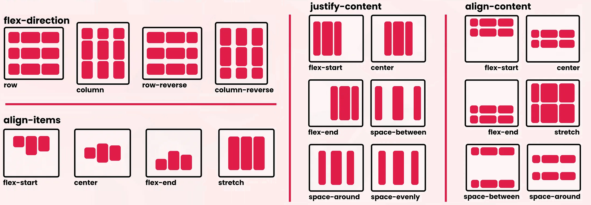
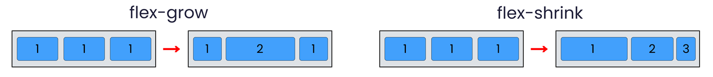

# Flex
- Hace que el elemento se comporte como un contenedor flexible.
- Los elementos hijos pueden ser flexibles o no.
- Los elementos hijos se pueden alinear horizontal y verticalmente.

 

## 1. Container:
| Propiedad         | Opciones                                                           | Definición                                                                                |
|-------------------|--------------------------------------------------------------------|-------------------------------------------------------------------------------------------|
| `flex-direction`  |  ----------------------------------------------------------------  | **Define la dirección de los flex-items dentro del contenedor.**                          |
|                   | row (Default)                                                      | Los flex-items se colocan en una fila.                                                    |
|                   | row-reverse                                                        | Los flex-items se colocan en una fila en sentido inverso.                                 |
|                   | column                                                             | Los flex-items se colocan en una columna.                                                 |
|                   | column-reverse                                                     | Los flex-items se colocan en una columna en sentido inverso.                              |
| `flex-wrap`       |  ----------------------------------------------------------------  | **Define si los flex-items se ajustan a una sola línea o se envuelven en varias líneas.** |
|                   | nowrap (Default)                                                   | Los flex-items se ajustan a una sola línea.                                               |
|                   | wrap                                                               | Los flex-items se envuelven en varias líneas.                                             |
|                   | wrap-reverse                                                       | Los flex-items se envuelven en varias líneas en sentido inverso.                          |
| `justify-content` |  ----------------------------------------------------------------  | **Alinea los flex-items en el eje principal.**                                            |
|                   | flex-start (Default)                                               | Alinea los flex-items al principio del contenedor.                                        |
|                   | flex-end                                                           | Alinea los flex-items al final del contenedor.                                            |
|                   | center                                                             | Alinea los flex-items en el centro del contenedor.                                        |
|                   | space-between                                                      | Alinea los flex-items con el primer flex-item al principio y el último al final.          |
|                   | space-around                                                       | Alinea los flex-items con el mismo espacio alrededor de cada uno.                         |
|                   | space-evenly                                                       | Alinea los flex-items con el mismo espacio entre ellos y alrededor de ellos.              |
| `align-items`     |  ----------------------------------------------------------------  | **Alinea los flex-items en el eje secundario o transversal.**                             |
|                   | flex-start, flex-end, center                                       | Igual que los anteriores.                                                                 |
|                   | baseline                                                           | Alinea los flex-items en la línea base del contenedor.                                    |
|                   | stretch                                                            | Estira los flex-items para que ocupen todo el contenedor.                                 |
| `align-content`   |  --------------------------------                                  | **Alinea las líneas de flex-items cuando hay varias líneas.**                             |
|                   | Las mismas opciones que `justify-content` + stretch                | Igual que los anteriores.                                                                 |

 

## 2. Items:
| Propiedad     | Opciones                                               | Definición                                                            |
|---------------|--------------------------------------------------------|-----------------------------------------------------------------------|
| `order`       | n (Default: 0)                                         | Define el orden de los flex-items.                                    |
| `flex-grow`   | n (Default: 0, no se expanden)                         | Define la capacidad de crecimiento de los flex-items.                 |
| `flex-shrink` | n (Default: 1, se encogen)                             | Define la capacidad de encogimiento de los flex-items.                |
| `flex-basis`  | tamaño (Default: auto, tamaño del contenido)           | Define el tamaño inicial de los flex-items antes de crecer o encoger. |
| `flex`        | número número tamaño (Default: 0 1 auto)               | Define `flex-grow`, `flex-shrink` y `flex-basis` en una sola línea.   |
| `align-self`  | auto, flex-start, flex-end, center, baseline, stretch  | Alinea un flex-item específico en el eje transversal.                 |

   

## *[volver al índice](../../../index.md)*