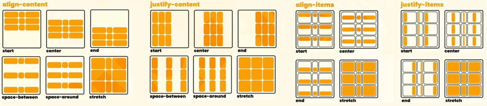

# Grid
- Hace que el elemento se comporte como un contenedor de cuadrícula.
- Los elementos hijos se pueden colocar en filas y columnas.
<br>

## 1. Container:
| Propiedad               | Opciones                     | Definición                                              |
|-------------------------|------------------------------|---------------------------------------------------------|
| `grid-template-columns` | tamaño tamaño tamaño ...     | Define el tamaño de las columnas de la cuadrícula.      |
| `grid-template-rows`    | tamaño tamaño tamaño ...     | Define el tamaño de las filas de la cuadrícula.         |
| `grid-template-areas`   | "nombre nombre nombre ..."   | Define el nombre de las áreas de la cuadrícula.         |
| `grid-template`         | filas / columnas             | Define las columnas y filas de la cuadrícula.           |
| `gap`                   | tamaño-filas tamaño-columnas | Define el espacio entre las filas y columnas.           |
| `justify-items`         | start, end, center, stretch  | Alinea los elementos en el eje principal.               |
| `align-items`           | start, end, center, stretch  | Alinea los elementos en el eje secundario.              |
| `place-items`           | start, end, center, stretch  | `justify-items` + `align-items`                         |
| `justify-content`       | start, end, center, stretch  | Alinea las columnas en el eje principal.                |
| `align-content`         | start, end, center, stretch  | Alinea las filas en el eje secundario.                  |
| `place-content`         | start, end, center, stretch  | `justify-content` + `align-content`                     |

<br>


<br>

## 2. Items:
| Propiedad               | Opciones                     | Definición                                              |
|-------------------------|----------------------------- |---------------------------------------------------------|
| `grid-column`           | número / número              | Define las columnas en las que se colocará el elemento. |
| `grid-row`              | número / número              | Define las filas en las que se colocará el elemento.    |
| `grid-area`             | nombre                       | Define el área en la que se colocará el elemento.       |
| `justify-self`          | start, end, center, stretch  | Alinea un elemento específico en el eje principal.      |
| `align-self`            | start, end, center, stretch  | Alinea un elemento específico en el eje secundario.     |

<br>

## 3. Properties:
- repeat():  
Repite un patrón de columnas o filas en la cuadrícula.
```css
grid-template-columns: repeat(3, 1fr); /* 3 columnas de igual tamaño */
```
- minmax():  
Define un tamaño mínimo y máximo para una fila o columna de la cuadrícula.
```css
grid-template-columns: repeat(3, minmax(100px, 1fr)); /* 3 columnas de mínimo 100px y máximo 1fr */
```
- auto-fill y auto-fit:  
Auto-fill: **Rellena** el espacio con el tamaño mínimo. Puede haber columnas vacías. 
Auto-fit: **Ajusta** el tamaño de las columnas al espacio disponible. Nunca habrá columnas vacías.
```css
grid-template-columns: repeat(
    auto-fill, /* Rellena el espacio con el tamaño mínimo */
    minmax(100px, 1fr)
);

grid-template-columns: repeat(
    auto-fit, /* Ajusta el tamaño de las columnas al espacio disponible */
    minmax(100px, 1fr)
);
```
<br>

## 4. Ejemplos
- Con grid-template-columns y grid-template-rows:
```css
.container {
    display: grid;                       /* Contenedor de cuadrícula */
    grid-template-columns: 1fr 1fr 1fr;  /* Tres columnas de igual tamaño */
    grid-template-rows: repeat(3, 1fr);  /* Tres filas de igual tamaño */
    gap: 10px;                           /* Espacio entre filas y columnas */
}

.item1 {
    grid-column: 1 / -1;                 /* Columnas 1 a la última */
    grid-row: 1 / 2;                     /* Filas 1 */
}

.item2 {
    grid-column-start: 1;
    grid-column-end: 2;                  /* Columna 1 */
    grid-row-start: 2;
    grid-row-end: 3;                     /* Fila 2 */
}

.item3 {
    grid-column: 2 / span 2;             /* Columnas 2 a 3 (Igual a 2 / 4) */
    grid-row: 2 / 3;                     /* Filas 2 */
}

.item4 {
    grid-column: 1 / 4;                  /* Columnas 1 a 3 (Igual a 1 / -1) */
    grid-row: 3 / 4;                     /* Filas 3 */
}
```

- Con grid-template-areas:
```css
.container {
    display: grid;                       /* Contenedor de cuadrícula */
    grid-template-columns: 1fr 1fr 1fr;  /* Tres columnas de igual tamaño */
    grid-template-rows: repeat(3, 1fr);  /* Tres filas de igual tamaño */
    gap: 10px;                           /* Espacio entre filas y columnas */
    grid-template-areas:
        "header header header"
        "sidebar content content"
        "footer footer footer";
}

.item1 {
    grid-area: header;                   /* Área de la cabecera */
}

.item2 {
    grid-area: sidebar;                  /* Área de la barra lateral */
}

.item3 {
    grid-area: content;                  /* Área del contenido */
}

.item4 {
    grid-area: footer;                   /* Área del pie de página */
}
```
<br><br><br>

## *[volver al índice](../../../README.md)*