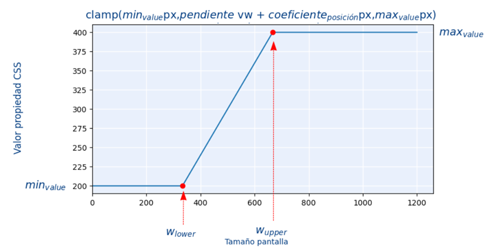

# Responsive Design

## 1. Viewport 🖥️
- `vh`: altura de la ventana.
- `vw`: ancho de la ventana.
- `vmin`: el menor entre `vh` y `vw`.
- `vmax`: el mayor entre `vh` y `vw`.
```html
<!-- Se utiliza para que el navegador ajuste el ancho de la página al ancho del dispositivo. -->
<meta name="viewport" content="width=device-width, initial-scale=1.0">
```
- Diferencias con 100%:
  - `100%` se refiere al tamaño del contenedor padre y `vw` se refiere al tamaño de la ventana.
  - `100%` no toma en cuenta el tamaño de la barra de desplazamiento y `vw` sí.
---
<br>


## 2. rem vs em 🔢
- `rem`: es el tamaño en pixeles multiplicado por el tamaño de la fuente de la etiqueta **html**.
- `em`: es el tamaño en pixeles multiplicado por el tamaño de la fuente de la etiqueta padre.
---
<br>


## 3. Cálculos 🧮
- `min()`: selecciona el menor entre dos valores.
- `max()`: selecciona el mayor entre dos valores.
- `clamp()`: selecciona un valor que se encuentre entre dos valores.
- `calc()`: realiza operaciones matemáticas.
```css
.c-titulo {
  font-size: min(100px, 10vw); /* Selecciona el menor entre 100px y 10vw */
}

.c-titulo2 {
  font-size: max(100px, 10vw); /* Selecciona el mayor entre 100px y 10vw */
}

.c-titulo3 {
  font-size: clamp(100px, 10vw, 200px); /* El valor es 10vw y no puede ser menor a 100px ni mayor a 200px */
}

.c-titulo4 {
  font-size: clamp(10px, 10vw + 2px, 20px); /* El valor es 10vw + 2px y no puede ser menor a 10px ni mayor a 20px */
  /*font-size: clamp(10px, calc(10vw + 2px), 20px); Son equivalentes */
}

.c-titulo5 {
  font-size: calc(10px + 2vw); /* El valor es 10px + 2vw */
}
```
---
<br>


## 4. Calcular tamaño de pantalla 📏
$$ \text{pendiente} = \frac{\left(\text{MAXvalue} - \text{MINvalue}\right)}{\left(\text{Wupper} - \text{Wlower}\right)} * 100 $$
$$ \text{coeficiente} = \text{MINvalue} - \left(\frac{\text{pendiente}}{100} * \text{Wlower}\right) $$



$$ \text{MAXvalue} = \left(\frac{\text{pendiente}}{100} * \text{Wupper}\right) + \text{coeficiente} $$
$$ \text{MINvalue} = \left(\frac{\text{pendiente}}{100} * \text{Wlower}\right) + \text{coeficiente} $$

$$ \text{Wupper} = \frac{\text{MAXvalue} - \text{coeficiente}}{\text{pendiente}/100} $$
$$ \text{Wlower} = \frac{\text{MINvalue} - \text{coeficiente}}{\text{pendiente}/100} $$

---
<br>

## 5. Imágenes 🖼️
- Usaremos diferentes imágenes dependiendo de:
  - Ancho o alto del dispositivo.
  - Pixel-ratio del dispositivo.
  - Tipos soportados por el navegador.

Ejemplo dependiendo del ancho:
- `media`: condición que debe cumplir el dispositivo para mostrar la imagen.
- `srcset`: conjunto de imágenes que se pueden mostrar.
```html
<picture>
  <source media="(min-width: 650px)" srcset="big_img.jpg">
  <source media="(min-width: 465px)" srcset="medium_img.jpg">
  
</picture>
```
---
<br>

## 6. Media Queries 📱
| Tipo       | Interno                                                                                                    | Externo |
|------------|------------------------------------------------------------------------------------------------------------|---------|
| Fluido     | El propio componente decide cómo se hace responsivo.<br>Lo hace de forma fluida al tamaño del dispositivo. | El que usa el componente decide cómo se hace responsivo. <br>Lo hace de forma fluida al tamaño del dispositivo. |
| Escalonado | El propio componente decide cómo se hace responsivo.<br>Lo hace solo para diversos tamaños de pantalla.    | El que usa el componente decide cómo se hace responsivo.<br>Lo hace solo para diversos tamaños de pantalla.    |

```css
/* Interno */
.c-titulo {
    font-size: 40px;
}
 
@media (min-width: 576px) {
    .c-titulo {
        font-size: 50px;
    }
}
  
@media (min-width: 768px) {
    .c-titulo {
        font-size: 55px;
    }
}
  
@media (min-width: 992px) {
    .c-titulo {
        font-size: 70px;
    }
}
```
```html
<p class="c-titulo">Título</p>
```
```css
/* Externo */
.g--font-size-1 {
    font-size: 40px;
}
.g--font-size-2 {
    font-size: 50px;
}
.g--font-size-3 {
    font-size: 55px;
}
.g--font-size-4 {
    font-size: 70px;
}
  
@media (min-width: 576px) {
    .g--font-size-1\@tablet {
        font-size: 40px;
    }
    .g--font-size-2\@tablet {
        font-size: 50px;
    }
    .g--font-size-3\@tablet {
        font-size: 55px;
    }
    .g--font-size-4\@tablet {
        font-size: 70px;
    }
}
  
@media (min-width: 768px) {
    .g--font-size-1\@desktop {
        font-size: 40px;
    }
    .g--font-size-2\@desktop {
        font-size: 50px;
    }
    .g--font-size-3\@desktop {
        font-size: 55px;
    }
    .g--font-size-4\@desktop {
        font-size: 70px;
    }
}
  
@media (min-width: 992px) {
    .g--font-size-1\@fulldesktop {
        font-size: 40px;
    }
    .g--font-size-2\@fulldesktop {
        font-size: 50px;
    }
    .g--font-size-3\@fulldesktop {
        font-size: 55px;
    }
    .g--font-size-4\@fulldesktop {
        font-size: 70px;
    }
}
```
```html
<p class="g--font-size-1 g--font-size-1@tablet g--font-size-1@desktop g--font-size-1@fulldesktop">Título</p>
```
---
<br>


<br><br><br>

## *[volver al índice](../../../README.md)*