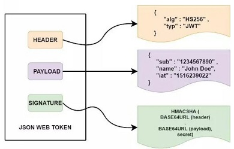

# JSON Web Token (JWT)
Es un estándar abierto basado en JSON propuesto por IETF para la creación de tokens de acceso que permiten la propagación de identidad y privilegios entre dos partes.
- El token está compuesto por 3 partes:
  - **Encabezado (Header)**: Objeto JSON que contiene el tipo de token y el algoritmo de firma utilizado (HMAC con SHA256).
  - **Carga útil (Payload)**: Objeto JSON que contiene la información que se desea transmitir.
  - **Firma (Signature)**: Es el resultado del hasheo de la concatenación del encabezado y la carga útil con una clave secreta, asegurando que el contenido no ha sido modificado.


```javascript
signature = HMACSHA256(base64UrlEncode(header) + "." + base64UrlEncode(payload), secret)
```

## 1. Web Site🌐
[JWT](https://jwt.io/)

---
<br>

## 2. Instalar módulo 🔧 
`npm install jsonwebtoken`

---
<br>

## 3. Importar módulo 📦 
```javascript
const jwt = require('jsonwebtoken');
```
---
<br>

## 4. Generar Token 📝 
Se le pueden pasar varias opciones al método `sign` para personalizar el token:
- **`expiresIn`:** Tiempo de expiración del token.
- **`issuer`:** Entidad que emite el token.
- **`audience`:** Destinatario del token.
- **`subject`:** Usuario para el que fue emitido el token.

```javascript
const payload = { id: 1, name: 'John Doe', email: 'doe@gmail.com'};
const secret  = '1234';
const options = {
    expiresIn: '1h',
    issuer: 'https://example.com',
    audience: 'https://example.com',
    subject: 'user'
};


const token = jwt.sign(payload, secret, options);
```
---
<br>

## 5. Verificar Token 📏 
```javascript
const token = req.header('token-name');

/* Check if token is provided */
if (!token) {
    return res.status(401).json({ message: 'No token provided' });
}

/* Verify token */
try{
  jwt.verify(token, secret); // This method returns the payload (id, name, email) if the token is valid.
}catch(err){
    return res.status(401).json({ message: 'Invalid token' });
}
```
---

## 6. Decodificar Token 📖 
```javascript
const token = req.header('token-name');
const decoded = jwt.decode(token);
console.log(decoded);

// Si quisieramos decodifcar el token a través de un navegador:
function decodeToken(token){
    var base64Url = token.split('.')[1];
    var base64 = base64Url.replace(/-/g, '+').replace(/_/g, '/');
    return JSON.parse(window.atob(base64));
}
```
<br><br><br>

## *[volver al índice](../../index.md)*