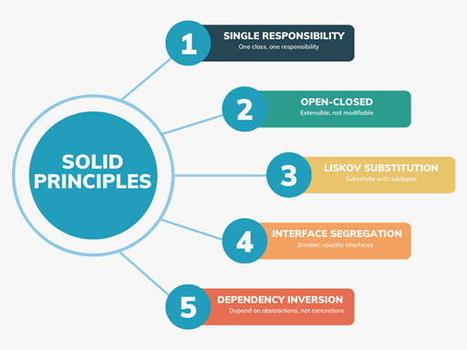

# SOLID
SOLID es un acrónimo que representa cinco principios de diseño de software orientado a objetos.  
Estos principios son fundamentales para crear sistemas de software que sean fáciles de mantener, escalar y entender.

## 1. Principios S.O.L.I.D.

### 1.1. S - Single Responsibility Principle (SRP)
- El principio de responsabilidad única establece que una clase (o módulo, función, etc.) debe tener una única razón para cambiar (una sola responsabilidad o propósito).
- Cuando una clase hace más de una cosa, se vuelve más difícil de mantener y extender, porque un cambio en una responsabilidad puede afectar las otras.
```java
class User {

    private String name;
    private String email;
    
    constructor(String name, String email) {
        this.name = name;
        this.email = email;
    }

    // Métodos relacionados a la clase User
    getName() {
        return this.name;
    }

    getEmail() {
        return this.email;
    }

    // Métodos no relacionados a la clase User
    addToCart(Product product) {
        // Lógica para agregar un producto al carrito
    }
}
```
---
<br>


### 1.2. O - Open/Closed Principle (OCP)
- El principio abierto/cerrado establece que las entidades de software (clases, módulos, funciones, etc.) deben estar abiertas para la extensión pero cerradas para la modificación.
- Esto significa que deberías poder agregar nuevas funcionalidades a una clase sin modificar su código existente, lo que ayuda a evitar errores y facilita el mantenimiento.
```java
// Original class
class Cart {
    addToCart(Product product) { }
    calculateTotal() {}
}

// Modified class
class Cart {
    addToCart(Product product) { }
    calculateTotal() { }
    calculateDiscountedTotal(discount) { }
}
```
---
<br>


### 1.3. L - Liskov Substitution Principle (LSP)
- El principio de sustitución de Liskov establece que los objetos de una clase base deben poder ser reemplazados por objetos de una clase derivada sin alterar el correcto funcionamiento del programa.
- Esto significa que las subclases deben ser substituibles por sus superclases sin afectar la funcionalidad del programa.
```java
class Animal {
    getName() { }
    emitSound() { }
    eat() { }
}
// Bird y Fish son subclases de Animal que extienden su funcionalidad pero no deberían modificar su comportamiento.
class Bird extends Animal {
    fly() { }
}
class Penguin extends Animal {
    swim() { }
}
```
---
<br>


### 1.4. I - Interface Segregation Principle (ISP)
- El principio de segregación de interfaces establece que una clase no debe verse obligada a depender de interfaces que no utiliza.
- Es mejor tener muchas interfaces específicas que una sola interfaz general con demasiadas responsabilidades.
- Esto mejora la cohesión y reduce el acoplamiento innecesario entre clases.

```java
// Violación del ISP: interfaz con métodos no aplicables a todas las clases
interface Printer {
    void print(Document doc);
    void scan(Document doc);
    void fax(Document doc);
}

class SimplePrinter implements Printer {
    public void print(Document doc) {
        // Imprimir documento
    }

    public void scan(Document doc) {
        // No aplica para esta impresora
        throw new UnsupportedOperationException();
    }

    public void fax(Document doc) {
        // No aplica para esta impresora
        throw new UnsupportedOperationException();
    }
}
```
```java
// Aplicación del ISP: interfaces separadas según funcionalidad
interface Printable {
    void print(Document doc);
}

interface Scannable {
    void scan(Document doc);
}

interface Faxable {
    void fax(Document doc);
}

class BasicPrinter implements Printable {
    public void print(Document doc) {
        // Imprimir documento
    }
}

class AdvancedPrinter implements Printable, Scannable, Faxable {
    public void print(Document doc) {
        // Imprimir
    }

    public void scan(Document doc) {
        // Escanear
    }

    public void fax(Document doc) {
        // Enviar fax
    }
}
```
---
<br>


### 1.5. D - Dependency Inversion Principle (DIP)
- El principio de inversión de dependencias establece que las clases de alto nivel no deben depender de clases de bajo nivel, sino de abstracciones (interfaces o clases abstractas).
- Las abstracciones no deben depender de los detalles, sino que los detalles deben depender de las abstracciones.
- Usa interfaces o clases abstractas para desacoplar la lógica principal de los detalles concretos.
```java
// Violación del DIP: el servicio depende directamente de una clase concreta
class MySQLUserRepository {
    public User findById(String id) {
        // Buscar usuario en MySQL
        return new User(id);
    }
}

class UserService {
    private final MySQLUserRepository repo = new MySQLUserRepository(); // ❌ Acoplamiento fuerte

    public User getUser(String id) {
        return repo.findById(id);
    }
}
```
```java
// Aplicación del DIP: ambos módulos dependen de una abstracción
interface UserRepository {
    User findById(String id);
}

class MySQLUserRepository implements UserRepository {
    public User findById(String id) {
        // Buscar usuario en MySQL
        return new User(id);
    }
}

class UserService {
    private final UserRepository repo;

    public UserService(UserRepository repo) { // ✅ Inyección de la abstracción
        this.repo = repo;
    }

    public User getUser(String id) {
        return repo.findById(id);
    }
}
```

<br><br><br>

## *[volver al índice](../README.md)*