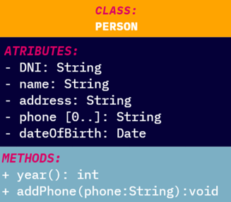
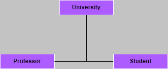
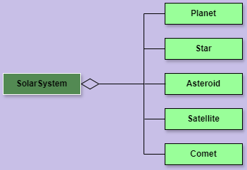
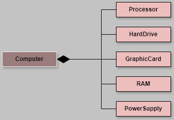
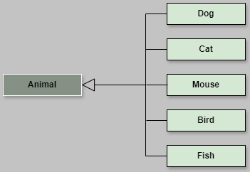
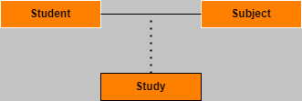
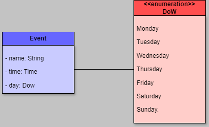

# UML
UML es un acrónimo de **Unified Modeling Language** (Lenguaje Unificado de Modelado). 
Es un lenguaje de modelado visual que se utiliza para especificar, diseñar, construir y documentar los artefactos de un sistema de software.

## Diagramas de clases:
Los diagramas de clases son una forma de representar gráficamente un sistema de información utilizando conceptos de la orientación a objetos.

### - Elementos de un diagrama de clases:
  

#### A. Clase: 
Representa un conjunto de objetos con características similares.

#### B. Atributo:
Representa una propiedad de la clase.
  - **Tipo**:
    - **Primitivo**: Tipo de dato básico (int, float, char, etc).
    - **Derivado**: Tipo de dato compuesto (String, Date, etc).

  - **Multiplicidad**: Representa la cantidad de objetos que pueden tener un atributo.
    | Multiplicidad | Descripción                           |
    | ------------- | --------------------------------------|
    | **0..1**      | Puede tener un valor o ninguno.       |
    | **0..\***     | Puede tener ninguno o varios valores. |
    | **\***        | Puede tener ninguno o varios valores. |
    | **1**         | Un solo valor. Es igual a 1..1.       |
    | **2**         | Dos valores. Es igual a 2..2.         |
    | **1..\***     | Puede tener uno o varios valores.     |
    | **n..m**      | Puede tener entre n y m valores.      |

  - **Visibilidad**: Atributos y métodos pueden ser public (+), private (-), protected (#) o package (~).

#### C. Método:
Representa una operación que puede realizar la clase.  

#### D. Relación:
Representa la asociación entre dos clases.
- **Asociación**: Representa una relación entre dos clases.
    - **Unidireccional**: Representa una relación de una sola dirección.
    - **Bidireccional**: Representa una relación de doble dirección.  

```java
class University {
    Professor professor;
    Student student;
}

class Professor {}

class Student {}
```
<br>

- **Agregación**: Representa una relación de tipo "contiene un", donde una clase es el contenedor y la otra es el contenido.  

```java
class SolarSystem {
    List<Planet> planets;
    Star star;
    List<Asteroid> asteroids;
    List<Satellite> satellites;
    List<Comet> comets;
}

class Planet {}
class Star {}
class Asteroid {}
class Satellite {}
class Comet {}
```
<br>

- **Composición**: Representa una relación de tipo "está compuesto por", donde la clase contenida no puede existir sin la clase contenedora.  

```java
class Computer {
    private Processor processor = new Processor();
    private HardDrive hardDrive = new HardDrive();
    private GraphicCard graphicCard = new GraphicCard();
    private RAM ram = new RAM();
    private PowerSupply powerSupply = new PowerSupply();
}

class Processor {}
class HardDrive {}
class GraphicCard {}
class RAM {}
class PowerSupply {}
```
<br>

- **Dependencia**: Representa una relación de dependencia entre dos clases, donde una clase depende de la otra.  

```java
class Printer {
    void print(Document doc) {
        System.out.println(doc.getContent());
    }
}

class Document {
    String getContent() {
        return "Contenido del documento";
    }
}
```
<br>

- **Herencia**: Representa la relación de tipo "es un",donde la clase hija hereda los atributos y métodos de la clase padre.  

```java
class Animal {
    void makeSound() {
        System.out.println("Some sound");
    }
}

class Dog extends Animal {
    void makeSound() {
        System.out.println("Bark");
    }
}

class Cat extends Animal {
    void makeSound() {
        System.out.println("Meow");
    }
}
```

#### E. Clase asociativa:
Es una clase que se utiliza para representar una relación entre dos o más clases.  


#### F. Enumeraciones:
Representa un conjunto de valores constantes.  



<br><br><br>

## *[volver al índice](../README.md)*